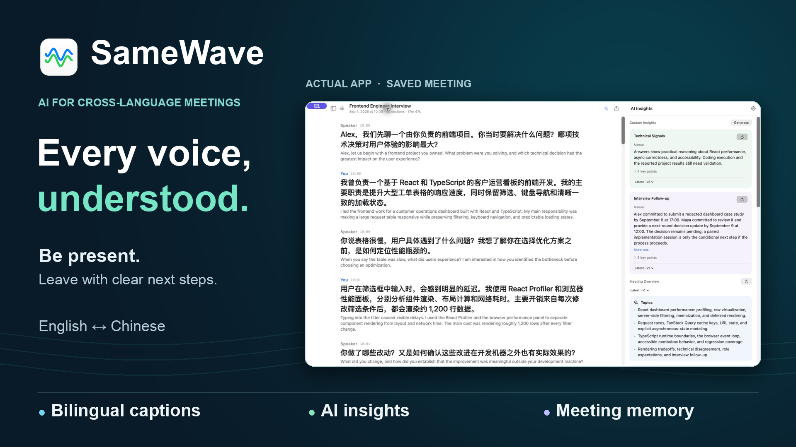
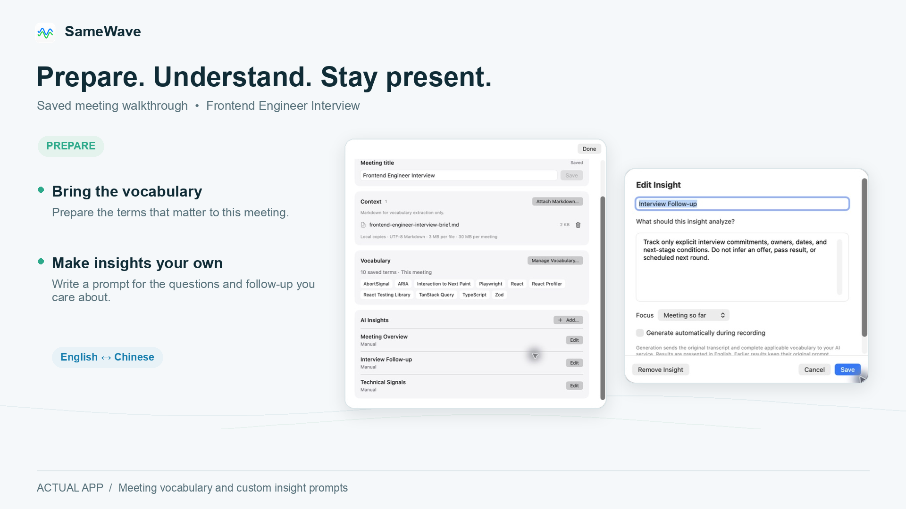
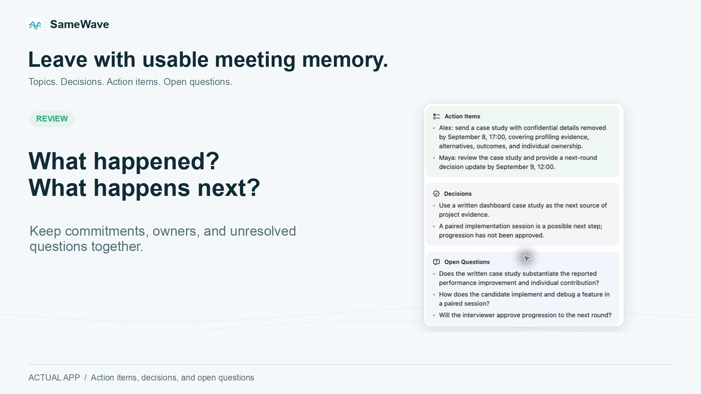

# SameWave

A native macOS app for live meeting captions, English–Chinese translation, and meeting notes. Speech recognition and translation run locally; no API key is needed for captions.

The interface supports English and Simplified Chinese. Open **SameWave → Settings… → General → App Language** to choose **Follow System** (the default), **English**, or **Chinese**. Your choice is saved automatically; quit and reopen SameWave to apply it. New AI Insights, including automatic updates and meeting summaries, use the active app language. Regenerate an insight after switching languages to create a version in the new language; saved versions retain their original text. Meeting languages and English Markdown export templates remain unchanged.



- **Follow the conversation.** Caption system audio and your microphone in speaking order, including overlapping speech.
- **Translate as you go.** Choose English or Simplified Chinese as source and target, or use the same language for transcription only.
- **Keep your notes.** Prepare meetings, add vocabulary, pause and resume, and revisit automatically saved transcripts. Export to Markdown when you're done.
- **Add AI when useful.** Generate custom insights, meeting summaries, and refined transcripts with an optional AI service.

Designed for one-on-one meetings: system audio is the other side, and the microphone is you. Capture includes all system output except SameWave; multiple remote speakers are not separated.

<details>
<summary>See meeting preparation and review</summary>

Screenshots from the Frontend Engineer Interview demo.





</details>

## Build and run

Requires **macOS 26+**, **Xcode 26+**, and [XcodeGen](https://github.com/yonaskolb/XcodeGen).

Set `SIGN_ID` in [`build.sh`](build.sh) to an Apple Development certificate available on your Mac, then run from the repository root:

```sh
xcodegen generate
./build.sh
```

This replaces `~/Desktop/SameWave.app` and launches it. For unsigned builds, tests, and signing details, see the [development guide](doc/06-development-and-validation.md).

On first use, grant speech recognition, microphone, and screen recording permissions when prompted. Speech and translation may need to download language resources.

## Your first meeting

1. Click **New Meeting**. Optionally add a title, Markdown documents, or vocabulary.
2. Choose source and target languages, enable the microphone if needed, and click **Start**.
3. Pause and resume as needed. Click **End** to review or export your transcript.

For AI features, turn on **Settings → General → Enable AI Services**, then configure your provider, API key, and model context window in **Settings → AI Services**. Preferences save automatically as you edit. Turning AI off stops AI tasks and makes all AI Services controls unavailable while keeping your configuration. Invalid input is shown inline and blocks new generation until corrected. **Done** closes Settings; connection preferences have no separate save or draft state. **Test Connection** checks the current configuration. See the [AI guide](doc/04-ai-insights-and-refinement.md) for provider requirements and insight controls.

To reuse insights across meetings, open **Settings → Insights**, click **Add Insight**, enter a title and instructions, choose the focus and automatic-generation preference, then **Save**. Edit or remove defaults there as needed. Each new meeting gets independent copies; existing meetings keep their own definitions. Removing every default leaves new meetings without custom insights. The initial default is an editable Meeting Overview with automatic generation off.

## Privacy

Audio is neither saved nor uploaded. Speech recognition, translation, attached documents, and meeting history are handled locally.

Optional AI features send text to your configured service: transcript content, prompts, and applicable vocabulary. Vocabulary extraction sends Markdown content; attaching a document alone makes no AI request. See the [AI guide](doc/04-ai-insights-and-refinement.md) for details on what each feature sends.

## Explore further

- [Documentation index](doc/README.md) — architecture, caption behavior, history, and AI.
- [Development guide](doc/06-development-and-validation.md) — build, test, permissions, and validation.
- [Contributing instructions](AGENTS.md) — project conventions and required checks.
