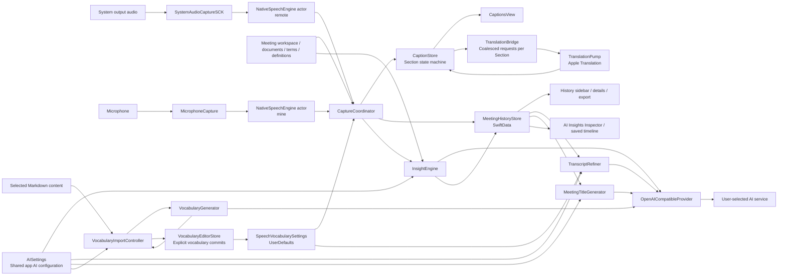

# Product and Architecture

## 1. Product goals

SameWave aims to make one-on-one cross-language meetings a continuous workflow with little manual effort:

1. Listen simultaneously to the other participant's system playback and your microphone.
2. Recognize both streams locally in real time.
3. Choose English or Simplified Chinese independently for source and target; translate between different languages or display same-language recognition directly.
4. Produce a readable conversation organized by turns, rather than two unrelated caption streams.
5. Save meeting preparation before capture and save continuously during recording, supporting pause, switching, and crash recovery.
6. Support custom, timestamped, persistent AI insights and deliberate full summaries after configuring a provider. Local captions remain independent.

The app does not save audio. Its core data is a set of text Sections carrying speaker, time, source, and translation.

## 2. Current stack

The app, executable, Swift module, project, and scheme are named `SameWave`; the test target is `SameWaveTests`, the bundle ID is `com.plus.samewave`, and the entry type is `SameWaveApp`. The interface supports English and Simplified Chinese. Settings opens on General, where App Language offers Follow System (the default), English, and Chinese. The choice saves immediately to the native per-app `AppleLanguages` preference; Follow System removes that override so future launches use the system preference. The app reads only its persistent domain when identifying an override, so inherited global languages never masquerade as an explicit selection. macOS per-app language settings use the same preference. English is the development language. Native string catalogs own UI and permission translations; SwiftUI localizes literal labels, while `String(localized:)` handles dynamic app-owned messages and errors. English plural rules belong in the catalog instead of concatenated words. Dates shown in meeting titles and version menus use native locale-aware formatting. System/framework errors and provider diagnostics retain their supplied details.

App identity, persisted IDs, recognition/translation language values, prompt source text, export templates, and generated meeting titles remain independent of interface language. New AI Insights use the active app language for conclusions, points, and summary items; all request paths share this language contract and context preflight counts the actual system prompt. Saved insight versions retain their original text; regeneration after a language change appends a new version. Editable meeting/insight titles, documents, vocabulary, transcripts, and saved results render verbatim. A new meeting's editable overview title is initialized in the current app language and then remains saved content. The fixed full-summary title and section headings are localized only for presentation. Markdown export keeps English metadata, including its explicit date format. Language changes take effect when the app reopens, as explained beside the picker. Existing sessions continue in their launch language; changing the preference never restarts capture or rewrites saved content. `AppLanguageSettings` owns this preference independently of the AI draft and vocabulary editor; native bundles still resolve all translations at launch.

| Area | Technology | Purpose |
|---|---|---|
| UI | SwiftUI + Observation | Three-column window reacting to explicit state |
| macOS integration | AppKit | Lifecycle, save panels, window controls, menu bar |
| System audio | ScreenCaptureKit `SCStream` | All system output except this process |
| Microphone | AVFoundation `AVAudioEngine` | The user's voice |
| Speech recognition | Speech `SpeechAnalyzer` + `DictationTranscriber` / `SpeechTranscriber` | Two local streaming ASR pipelines; English uses an editable local vocabulary model |
| Translation | Translation `TranslationSession` | Local English/Simplified Chinese translation in both directions; same-language bypass |
| Persistence | SwiftData | Meetings, transcript lines, titles, insights, refinements |
| Cloud AI | `URLSession` + OpenAI `/chat/completions` | Optional insights, refinement, titles, Markdown vocabulary extraction |
| Secrets | Security / Keychain | API key storage |
| Project generation | XcodeGen | Generate Xcode projects from `project.yml` |
| Tests | XCTest | Domain logic and in-memory SwiftData validation |

The main target has no third-party dependencies. Apple frameworks provide audio, recognition, translation, storage, and UI.

## 3. Repository structure

| Path | Responsibility |
|---|---|
| [`Sources/`](../Sources/) | App source and resources |
| [`Sources/Resources/`](../Sources/Resources/) | Asset Catalog, Info.plist, entitlements |
| [`doc/`](./) | Domain references, requirements, decisions |
| [`project.yml`](../project.yml) | XcodeGen declaration; target and build-setting source of truth |
| [`build.sh`](../build.sh) | Local build, stable signing, installation, launch |
| [`README.md`](../README.md) | Product, usage, privacy, getting started |
| [`AGENTS.md`](../AGENTS.md) | Collaboration, change, and validation rules |

`SameWave.xcodeproj` is generated locally from `project.yml`. It is neither versioned nor maintained manually.

## 4. Component relationships



Turning off AI synchronously asks app assembly to cancel the coordinator’s insight, refinement/title, and meeting vocabulary owners, plus personal vocabulary extraction and draft service checks. Cancellation preserves local work and retained results. `AISettings.isAvailable` combines the master switch with connection validity; `isConfigured` describes credentials alone.

`CaptureCoordinator` orchestrates runtime work; `CaptionStore` is the only write boundary for the live conversation model. SwiftUI views primarily read observable state and invoke coordinator actions.

## 5. Layers and responsibilities

### 5.1 App assembly

[`Sources/App/SameWaveApp.swift`](../Sources/App/SameWaveApp.swift):

- Creates the main window, Settings sheets/menu command, and menu-bar entry. Personal vocabulary editing lives inside Settings.
- `AppDelegate` creates and connects `CaptureCoordinator`, `MeetingHistoryStore`, `AISettings`, `InsightEngine`, `TranscriptRefiner`, `MeetingTitleGenerator`, `VocabularyEditorStore`, and its `VocabularyImportController`.
- Requests speech/microphone permissions at launch and restores the last selected meeting. Interrupted recordings become paused and drafts remain drafts; no valid selection chooses the most recently created meeting, or the empty state when none exist.
- Shows a blocking error if SwiftData cannot open, without starting a nonpersistent alternative.

### 5.2 Capture and recognition

- [`SystemAudioCaptureSCK.swift`](../Sources/Capture/SystemAudioCaptureSCK.swift): system audio → mono Float samples.
- [`MicrophoneCapture.swift`](../Sources/Capture/MicrophoneCapture.swift): default input → mono Float samples; rebuilds the tap when the device changes.
- [`NativeSpeechEngine.swift`](../Sources/Capture/NativeSpeechEngine.swift): actor-isolated bounded audio stream, sample-rate conversion, SpeechAnalyzer input, awaitable interim/final callbacks.
- [`SpeechVocabularySettings.swift`](../Sources/Capture/SpeechVocabularySettings.swift): English defaults, normalization, and UserDefaults persistence. `VocabularyEditorStore` owns app-session manual/row drafts and extraction, committing explicit actions independently of AI settings.
- [`CustomSpeechLanguageModel.swift`](../Sources/Capture/CustomSpeechLanguageModel.swift): builds and caches Apple custom language models by vocabulary fingerprint.

Both capture components share the conceptual interface `onAudio`, `inputSampleRate`, and `start/stop`, allowing the coordinator to connect both streams in the same way.

### 5.3 Live domain

- [`CaptureCoordinator.swift`](../Sources/Meeting/CaptureCoordinator.swift): lifecycle, dual-stream assembly, ASR routing, translation and persistence scheduling.
- [`MeetingModels.swift`](../Sources/Meeting/MeetingModels.swift): speakers, languages, lifecycle, Section content/translation state types.
- [`CaptionStore.swift`](../Sources/Meeting/CaptionStore.swift): chronological display turns, source fragments, translation progress.
- [`SpeechHypothesis.swift`](../Sources/Meeting/SpeechHypothesis.swift): cumulative recognition word alignment and ownership across interruptions.
- [`TranslationBridge.swift`](../Sources/Meeting/TranslationBridge.swift): latest pending request per Section, in-flight tracking, awaitable idle boundary.
- [`TranslationPump.swift`](../Sources/Meeting/TranslationPump.swift): long-lived `TranslationSession`, translation execution and results.

### 5.4 Data and output

- [`MeetingHistory.swift`](../Sources/History/MeetingHistory.swift): SwiftData models, incremental upsert, recovery, deletion; `MeetingWorkspace.swift` owns preparation models and `InsightSnapshot.swift` owns append-only results.
- [`TranscriptExporter.swift`](../Sources/History/TranscriptExporter.swift): live or saved meeting Markdown export.
- [`Support.swift`](../Sources/Shared/Support.swift): text validity and shared date formats.

### 5.5 AI infrastructure and use cases

- [`InsightModels.swift`](../Sources/Insights/InsightModels.swift): the structured response, exact request evidence, and conservative full-input budget.
- [`InsightEngine.swift`](../Sources/Insights/InsightEngine.swift): interval/content scheduling, manual priority, cancellation, immediate snapshot persistence, and local save retry.
- [`MeetingRefinementController.swift`](../Sources/Insights/MeetingRefinementController.swift): one coordinator-retained owner per meeting for refinement/title tasks, progress, and errors across navigation; results save through history to the original meeting.
- [`TranscriptRefiner.swift`](../Sources/Insights/TranscriptRefiner.swift): independent post-meeting proofreading, retranslation, glossary merging in batches.
- [`MeetingTitleGenerator.swift`](../Sources/Insights/MeetingTitleGenerator.swift): one-shot title requests parallel to refinement, input budgets, output validation.
- [`LLMProvider.swift`](../Sources/AI/LLMProvider.swift): minimal provider protocol, errors, provider configuration.
- [`OpenAICompatibleProvider.swift`](../Sources/AI/OpenAICompatibleProvider.swift): the sole HTTP implementation.
- [`AISettings.swift`](../Sources/AI/AISettings.swift): app-wide UserDefaults + Keychain configuration, immediate master switch, and availability validation.
- [`AISettingsDraft.swift`](../Sources/AI/AISettingsDraft.swift): editable preferences and their cancellable connection-test/model-discovery state. Settings dismissal invalidates these checks while preserving the draft.
- [`JSONResponseParser.swift`](../Sources/AI/JSONResponseParser.swift): shared strict JSON decoding boundary.
- [`VocabularyImportController.swift`](../Sources/Capture/VocabularyImportController.swift): app-owned import state, per-request results, current progress, stop/retry, selective saving.
- [`VocabularyEditorView.swift`](../Sources/Capture/VocabularyEditorView.swift): shared native grouped-form sections for manual editing and extraction in meeting sheets and the embedded Settings tab. Closing either presenter preserves unfinished app-session work; Stop and Discard are explicit actions.

### 5.6 Presentation

- [`MainView.swift`](../Sources/App/MainView.swift): three-column container, draggable Inspector width, long-lived translation-session attachment.
- [`MeetingSidebar.swift`](../Sources/App/MeetingSidebar.swift): SwiftData history query, selection, deletion, and per-meeting background AI activity.
- [`MeetingStage.swift`](../Sources/App/MeetingStage.swift): preparation/live/history stage, header, timer, capture controls; `MeetingPreparationView.swift` edits owned preparation.
- [`InsightInspector.swift`](../Sources/App/InsightInspector.swift): peer insight cards, live/history generation, independent saved versions, offline reading, and save retry.
- [`CaptionsView.swift`](../Sources/Meeting/CaptionsView.swift): live Section list.
- [`HistoryDetailView.swift`](../Sources/History/HistoryDetailView.swift): saved transcript lines.
- [`InsightResultCard.swift`](../Sources/Insights/InsightResultCard.swift): concise results with independent reading state, history, and local save retry. [`MeetingSummaryCards.swift`](../Sources/Insights/MeetingSummaryCards.swift) renders the expanded named sections.
- [`MeetingPreparationView.swift`](../Sources/Meeting/MeetingPreparationView.swift): four preparation cards and retained-result archive. `MeetingContextView.swift` owns attachment controls; `MeetingVocabularyView.swift` hosts the shared vocabulary editor; `InsightDefinitionEditor.swift` owns definition edits.
- [`SettingsView.swift`](../Sources/App/SettingsView.swift): General, AI Services, and Vocabulary tabs with native sheet routing over the current main/preparation surface; AI configuration actions select AI Services directly. One shared Done footer dismisses every tab without saving or discarding drafts; a pending-connection link on General and Vocabulary returns to AI Services.
- [`GeneralSettingsView.swift`](../Sources/App/GeneralSettingsView.swift): language picker and automatic-save/reopen guidance. [`AppLanguageSettings.swift`](../Sources/App/AppLanguageSettings.swift) owns the native per-app language preference.
- [`AISettingsView.swift`](../Sources/AI/AISettingsView.swift): renders the immediate AI master switch and the connection draft with discovery, testing, and scoped Save Changes/Revert actions that leave Settings open.
- [`TrafficLightConfigurator.swift`](../Sources/App/TrafficLightConfigurator.swift): macOS window button positioning after hiding the title bar.

### 5.7 Resources

- [`Assets.xcassets`](../Sources/Resources/Assets.xcassets/): app icon and assets.
- [`Info.plist`](../Sources/Resources/Info.plist): generated app properties.
- [`SameWave.entitlements`](../Sources/Resources/SameWave.entitlements): microphone and runtime permission declarations.

### 5.8 Tests and concurrency

- [`CaptionStoreTests.swift`](../Tests/CaptionStoreTests.swift): segmentation, overlap ownership, restore, translation progress invariants.
- [`TranslationBridgeTests.swift`](../Tests/TranslationBridgeTests.swift): coalescing, cross-Section ordering, idle drain.
- [`MeetingHistoryStoreTests.swift`](../Tests/MeetingHistoryStoreTests.swift): in-memory upsert, pruning, and empty-workspace retention. `MeetingWorkspaceTests.swift` also verifies on-disk reopen and artifact ownership.
- [`InsightEngineTests.swift`](../Tests/InsightEngineTests.swift): full input, scheduling, priority, cancellation, versioned persistence, failures, and strict result parsing.
- [`OpenAICompatibleProviderTests.swift`](../Tests/OpenAICompatibleProviderTests.swift): Structured Outputs request contracts and built-in models.
- [`TranscriptRefinerTests.swift`](../Tests/TranscriptRefinerTests.swift): line/character batch boundaries. [`MeetingRefinementControllerTests.swift`](../Tests/MeetingRefinementControllerTests.swift) verifies retained progress, concurrent owners, background saves/titles, failure/retry, partial success, deletion, and scoped persistence recovery.
- [`MeetingTitleGeneratorTests.swift`](../Tests/MeetingTitleGeneratorTests.swift): title requests, context, output bounds.
- [`MeetingLanguageTests.swift`](../Tests/MeetingLanguageTests.swift): fixed labels, four pairs, same-language bypass.
- [`SpeechVocabularySettingsTests.swift`](../Tests/SpeechVocabularySettingsTests.swift): defaults, normalization, persistence.
- Both targets use `SWIFT_STRICT_CONCURRENCY: complete`; platform I/O uses actors or MainActor isolation rather than unsafe Sendable escapes.

## 6. UI information architecture

```text
┌────────────────┬────────────────────────────────────────┬────────────────────┐
│ Meetings       │ Live captions / History details        │ AI Insights        │
│                │                                        │                    │
│ Draft meetings │ Preparation / Speaker 14:32             │ Custom insight     │
│ Recording…     │ Target text (primary)                  │ Generate / History │
│ Paused         │ Source text (secondary if translated)  │ Saved result times │
│ Ended meetings │                                        │ Topics / Actions   │
│                │ [Source → Target][Mic][Pause][End]      │ Full summary       │
└────────────────┴────────────────────────────────────────┴────────────────────┘
```

- The center owns transcripts and draft preparation; insight cards belong to the right Inspector. Custom definitions appear newest first, above the initial Overview, with meeting-wide sections last after End. Structured overviews and full summaries display Topics, Suggestions, Action Items, Decisions, and Open Questions directly as cards, with shared generation/history controls and no enclosing summary card. Each insight owns its history. All result content is read on the cards or in export, without a Details screen or generated supporting quotes. Preparation contains four concise cards with separate management/editing sheets. Vocabulary previews up to twelve terms in wrapping chips; its management sheet shows the complete read-only Context file list.
- History and live captions share a window; there is no separate floating caption `NSPanel`.
- The control dock occupies a separate layout row below the scrollable preparation/captions, preventing content from scrolling behind controls. It places language selectors above capture controls when the English labels need more width. History uses a two-line title/metadata header with compact action icons; tooltips and accessibility labels retain full action names.
- Inspector width is draggable and persists through `@AppStorage`.
- Settings is a native sheet with General, AI Services, and Vocabulary tabs. General is initially selected and saves its language choice immediately, with a Done footer and guidance to quit and reopen the app. AISettingsDraft belongs to SettingsNavigation, preserving pending preferences across tab switches and dismissal; Save/Cancel affects connection and context-window preferences only; the master switch applies immediately. All three tabs use native grouped forms with system section headers, neutral surfaces, standard controls, and fixed action footers. The Vocabulary tab directly embeds the shared editor without a repeated page heading; its saved-term section identifies the scope and its Done footer only dismisses. There is no Manage landing page, independent window, or nested vocabulary sheet. Configure AI Services switches tabs in the same 600×540 Settings sheet. Choosing files stays local; Extract explicitly sends text. Both hosts preserve drafts, suggestions, reading state, and background work on dismissal. Suggested Terms owns review actions and feedback; vocabulary commits never submit another draft. Vocabulary sections have independent observation boundaries, and only uniform 36-point term rows are lazy within the form’s single scroll container. Their fixed geometry preserves reading position while keeping large-list tab changes bounded by visible content.

## 7. Platform and permissions

The deployment target is macOS 26.0. Required capabilities:

- Screen recording: ScreenCaptureKit system audio access.
- Microphone: input access when microphone captions are enabled.
- Speech recognition: SpeechAnalyzer.
- Translation language resources: prepared by the system on first use of a language pair.
- Network: local captions/translation need no persistent connection; AI requires an enabled master switch and a configured provider.

App Sandbox is disabled to reduce restrictions on capture and model resources. Hardened Runtime is enabled with the audio-input entitlement.

## 8. Privacy boundaries

“Local” applies to the live captioning pipeline: audio, ASR, Apple Translation, and SwiftData run on-device. AI insights, refinement, and titles send transcript text to the user's selected third-party endpoint. Refinement sends the complete personal vocabulary frozen at operation start; insights send the full current applicable meeting/personal vocabulary and retain an exact input snapshot; title requests send no vocabulary. README and the AI guide describe these boundaries; settings helper text focuses on the controls and their immediate effects.

## Phase 2 boundaries

Meeting workspaces own documents, confirmed vocabulary, custom definitions, and append-only insight snapshots. Markdown attachments supply vocabulary extraction; document retrieval, goals, templates, cross-meeting projects, and notifications remain candidate extensions. See [Phase 2](phase-2-spec.md) for adopted choices and [validation](phase-2-validation.md) for evidence. No new third-party dependency or generic project framework was added.
