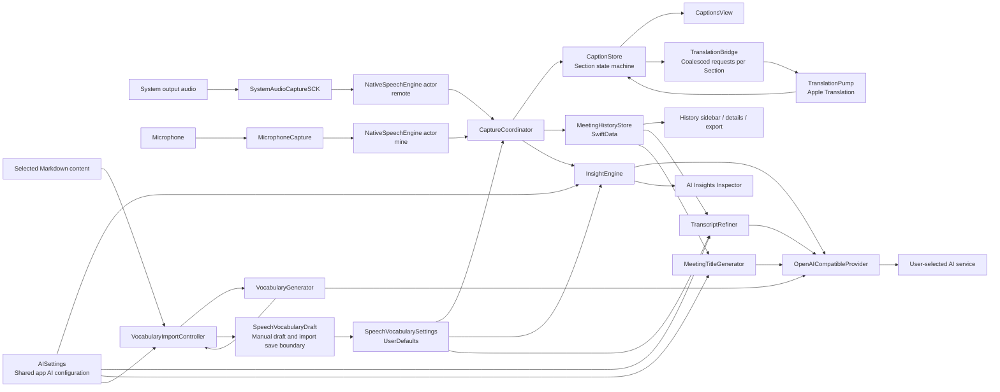

# Product and Architecture

## 1. Product goals

SameWave aims to make one-on-one cross-language meetings a continuous workflow with little manual effort:

1. Listen simultaneously to the other participant's system playback and your microphone.
2. Recognize both streams locally in real time.
3. Choose English or Simplified Chinese independently for source and target; translate between different languages or display same-language recognition directly.
4. Produce a readable conversation organized by turns, rather than two unrelated caption streams.
5. Save continuously during recording, supporting pause, switching, and crash recovery.
6. Send text to a cloud service for insights or refinement only after the user explicitly configures a provider.

The app does not save audio. Its core data is a set of text Sections carrying speaker, time, source, and translation.

## 2. Current stack

The app, executable, Swift module, project, and scheme are named `SameWave`; the test target is `SameWaveTests`, the bundle ID is `com.plus.samewave`, and the entry type is `SameWaveApp`. App-owned UI, export templates, AI insights, and generated titles use English. Transcript content follows the meeting's language pair.

| Area | Technology | Purpose |
|---|---|---|
| UI | SwiftUI + Observation | Three-column window reacting to explicit state |
| macOS integration | AppKit | Lifecycle, save panels, window controls, menu bar |
| System audio | ScreenCaptureKit `SCStream` | All system output except this process |
| Microphone | AVFoundation `AVAudioEngine` | The user's voice |
| Speech recognition | Speech `SpeechAnalyzer` + `DictationTranscriber` / `SpeechTranscriber` | Two local streaming ASR pipelines; English uses an editable local vocabulary model |
| Translation | Translation `TranslationSession` | Local English/Simplified Chinese translation in both directions; same-language bypass |
| Persistence | SwiftData | Meetings, transcript lines, titles, insights, refinements |
| Cloud AI | `URLSession` + OpenAI `/chat/completions` | Optional insights, refinement, titles, Markdown vocabulary extraction |
| Secrets | Security / Keychain | API key storage |
| Project generation | XcodeGen | Generate Xcode projects from `project.yml` |
| Tests | XCTest | Domain logic and in-memory SwiftData validation |

The main target has no third-party dependencies. Apple frameworks provide audio, recognition, translation, storage, and UI.

## 3. Repository structure

| Path | Responsibility |
|---|---|
| [`Sources/`](../Sources/) | App source and resources |
| [`Sources/Resources/`](../Sources/Resources/) | Asset Catalog, Info.plist, entitlements |
| [`doc/`](./) | Domain references, requirements, decisions |
| [`project.yml`](../project.yml) | XcodeGen declaration; target and build-setting source of truth |
| [`build.sh`](../build.sh) | Local build, stable signing, installation, launch |
| [`README.md`](../README.md) | Product, usage, privacy, getting started |
| [`AGENTS.md`](../AGENTS.md) | Collaboration, change, and validation rules |

`SameWave.xcodeproj` is generated locally from `project.yml`. It is neither versioned nor maintained manually.

## 4. Component relationships



`CaptureCoordinator` orchestrates runtime work; `CaptionStore` is the only write boundary for the live conversation model. SwiftUI views primarily read observable state and invoke coordinator actions.

## 5. Layers and responsibilities

### 5.1 App assembly

[`Sources/App/SameWaveApp.swift`](../Sources/App/SameWaveApp.swift):

- Creates the main window, Settings, Markdown vocabulary window, and menu-bar entry.
- `AppDelegate` creates and connects `CaptureCoordinator`, `MeetingHistoryStore`, `AISettings`, `InsightEngine`, `TranscriptRefiner`, `MeetingTitleGenerator`, `SpeechVocabularyDraft`, and `VocabularyImportController`.
- Requests speech/microphone permissions at launch and restores the last selected meeting. Unfinished records become paused; no valid selection means a new meeting.
- Shows a blocking error if SwiftData cannot open, without starting a nonpersistent alternative.

### 5.2 Capture and recognition

- [`SystemAudioCaptureSCK.swift`](../Sources/Capture/SystemAudioCaptureSCK.swift): system audio → mono Float samples.
- [`MicrophoneCapture.swift`](../Sources/Capture/MicrophoneCapture.swift): default input → mono Float samples; rebuilds the tap when the device changes.
- [`NativeSpeechEngine.swift`](../Sources/Capture/NativeSpeechEngine.swift): actor-isolated bounded audio stream, sample-rate conversion, SpeechAnalyzer input, awaitable interim/final callbacks.
- [`SpeechVocabularySettings.swift`](../Sources/Capture/SpeechVocabularySettings.swift): English defaults, normalization, UserDefaults persistence, and app-owned `SpeechVocabularyDraft`. Imports save only selected new terms and add them to the draft, keeping other unsaved settings edits independent.
- [`CustomSpeechLanguageModel.swift`](../Sources/Capture/CustomSpeechLanguageModel.swift): builds and caches Apple custom language models by vocabulary fingerprint.

Both capture components share the conceptual interface `onAudio`, `inputSampleRate`, and `start/stop`, allowing the coordinator to connect both streams in the same way.

### 5.3 Live domain

- [`CaptureCoordinator.swift`](../Sources/Meeting/CaptureCoordinator.swift): lifecycle, dual-stream assembly, ASR routing, translation and persistence scheduling.
- [`MeetingModels.swift`](../Sources/Meeting/MeetingModels.swift): speakers, languages, lifecycle, Section content/translation state types.
- [`CaptionStore.swift`](../Sources/Meeting/CaptionStore.swift): single-floor ownership, segmentation, source text, translation versions.
- [`TranslationBridge.swift`](../Sources/Meeting/TranslationBridge.swift): latest pending request per Section, in-flight tracking, awaitable idle boundary.
- [`TranslationPump.swift`](../Sources/Meeting/TranslationPump.swift): long-lived `TranslationSession`, translation execution and results.

### 5.4 Data and output

- [`MeetingHistory.swift`](../Sources/History/MeetingHistory.swift): SwiftData models, incremental upsert, recovery, deletion.
- [`TranscriptExporter.swift`](../Sources/History/TranscriptExporter.swift): live or saved meeting Markdown export.
- [`Support.swift`](../Sources/Shared/Support.swift): text validity and shared date formats.

### 5.5 AI infrastructure and use cases

- [`InsightModels.swift`](../Sources/Insights/InsightModels.swift): the single structured insight model.
- [`InsightEngine.swift`](../Sources/Insights/InsightEngine.swift): cancellable live triggers and one-shot historical insights.
- [`TranscriptRefiner.swift`](../Sources/Insights/TranscriptRefiner.swift): independent post-meeting proofreading, retranslation, glossary merging in batches.
- [`MeetingTitleGenerator.swift`](../Sources/Insights/MeetingTitleGenerator.swift): one-shot title requests parallel to refinement, input budgets, output validation.
- [`LLMProvider.swift`](../Sources/AI/LLMProvider.swift): minimal provider protocol, errors, provider configuration.
- [`OpenAICompatibleProvider.swift`](../Sources/AI/OpenAICompatibleProvider.swift): the sole HTTP implementation.
- [`AISettings.swift`](../Sources/AI/AISettings.swift): app-wide UserDefaults + Keychain configuration and availability validation.
- [`JSONResponseParser.swift`](../Sources/AI/JSONResponseParser.swift): shared strict JSON decoding boundary.
- [`VocabularyImportController.swift`](../Sources/Capture/VocabularyImportController.swift): app-owned import state, per-request results and timing, stop/retry, selective saving.
- [`VocabularyImportWindow.swift`](../Sources/Capture/VocabularyImportWindow.swift): compact progress, editable selection, source disclosure, and request details in a separate window. Actual window closure cancels work and discards unsaved results.

### 5.6 Presentation

- [`MainView.swift`](../Sources/App/MainView.swift): three-column container, draggable Inspector width, long-lived translation-session attachment.
- [`MeetingSidebar.swift`](../Sources/App/MeetingSidebar.swift): SwiftData history query, selection, deletion.
- [`MeetingStage.swift`](../Sources/App/MeetingStage.swift): live/history stage, header, timer, capture controls.
- [`InsightInspector.swift`](../Sources/App/InsightInspector.swift): live and historical insight generation and display.
- [`CaptionsView.swift`](../Sources/Meeting/CaptionsView.swift): live Section list.
- [`HistoryDetailView.swift`](../Sources/History/HistoryDetailView.swift): saved transcript lines.
- [`InsightCards.swift`](../Sources/Insights/InsightCards.swift): typed insight cards.
- [`SettingsView.swift`](../Sources/App/SettingsView.swift): tabs and cross-window navigation; AI configuration actions select AI Services directly.
- [`AISettingsView.swift`](../Sources/AI/AISettingsView.swift): AI draft configuration, model discovery, connection testing, saving.
- [`SpeechVocabularySettingsView.swift`](../Sources/Capture/SpeechVocabularySettingsView.swift): English vocabulary editing, save/cancel, direct Markdown file selection before opening generation.
- [`TrafficLightConfigurator.swift`](../Sources/App/TrafficLightConfigurator.swift): macOS window button positioning after hiding the title bar.

### 5.7 Resources

- [`Assets.xcassets`](../Sources/Resources/Assets.xcassets/): app icon and assets.
- [`Info.plist`](../Sources/Resources/Info.plist): generated app properties.
- [`SameWave.entitlements`](../Sources/Resources/SameWave.entitlements): microphone and runtime permission declarations.

### 5.8 Tests and concurrency

- [`CaptionStoreTests.swift`](../Tests/CaptionStoreTests.swift): segmentation, floor, restore, generation invariants.
- [`TranslationBridgeTests.swift`](../Tests/TranslationBridgeTests.swift): coalescing, cross-Section ordering, idle drain.
- [`MeetingHistoryStoreTests.swift`](../Tests/MeetingHistoryStoreTests.swift): in-memory upsert, pruning, empty-record deletion.
- [`InsightEngineTests.swift`](../Tests/InsightEngineTests.swift): context windows and strict JSON parsing.
- [`OpenAICompatibleProviderTests.swift`](../Tests/OpenAICompatibleProviderTests.swift): Structured Outputs request contracts and built-in models.
- [`TranscriptRefinerTests.swift`](../Tests/TranscriptRefinerTests.swift): line/character batch boundaries.
- [`MeetingTitleGeneratorTests.swift`](../Tests/MeetingTitleGeneratorTests.swift): title requests, context, output bounds.
- [`MeetingLanguageTests.swift`](../Tests/MeetingLanguageTests.swift): fixed labels, four pairs, same-language bypass.
- [`SpeechVocabularySettingsTests.swift`](../Tests/SpeechVocabularySettingsTests.swift): defaults, normalization, persistence.
- Both targets use `SWIFT_STRICT_CONCURRENCY: complete`; platform I/O uses actors or MainActor isolation rather than unsafe Sendable escapes.

## 6. UI information architecture

```text
┌────────────────┬────────────────────────────────────────┬────────────────────┐
│ Meetings       │ Live captions / History details        │ AI Insights        │
│                │                                        │                    │
│ New Meeting    │ Speaker  14:32                         │ Current Topic      │
│ Recording…     │ Target text (primary)                  │ Suggested Answer   │
│ Paused         │ Source text (secondary if translated)  │ Suggestions        │
│ Ended meetings │                                        │ Action Items       │
│                │ [Source → Target][Mic][Pause][End]      │ Decisions          │
└────────────────┴────────────────────────────────────────┴────────────────────┘
```

- The center owns transcripts; insights belong exclusively to the right Inspector.
- History and live captions share a window; there is no separate floating caption `NSPanel`.
- The control dock occupies real layout space through `safeAreaInset`, preventing captions from scrolling behind translucent controls. It places language selectors above capture controls when the English labels need more width. History uses a two-line title/metadata header with compact action icons; tooltips and accessibility labels retain full action names.
- Inspector width is draggable and persists through `@AppStorage`.
- Settings has AI Services and Vocabulary tabs. Both explicitly save/cancel rather than changing runtime configuration on each keystroke. AI configuration actions select the AI tab without committing vocabulary drafts. Vocabulary opens the first file picker directly; selected files then open a separate generation/review window whose task state is independent of the Settings Scene. Review can proceed during generation; saving selected new terms does not submit other manual settings drafts.

## 7. Platform and permissions

The deployment target is macOS 26.0. Required capabilities:

- Screen recording: ScreenCaptureKit system audio access.
- Microphone: input access when microphone captions are enabled.
- Speech recognition: SpeechAnalyzer.
- Translation language resources: prepared by the system on first use of a language pair.
- Network: local captions/translation need no persistent connection; AI requires the configured provider.

App Sandbox is disabled to reduce restrictions on capture and model resources. Hardened Runtime is enabled with the audio-input entitlement.

## 8. Privacy boundaries

“Local” applies to the live captioning pipeline: audio, ASR, Apple Translation, and SwiftData run on-device. AI insights, refinement, and titles send transcript text to the user's selected third-party endpoint. Refinement sends the complete saved vocabulary frozen at operation start; insights send only terms matched in recent context; title requests send no vocabulary. Settings discloses these boundaries, and product copy must remain consistent with them.
