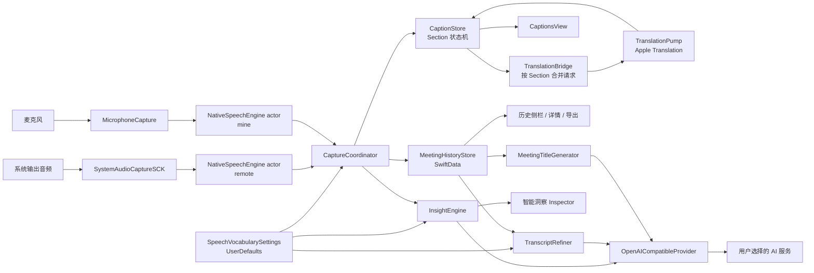

# 项目全景与架构

## 1. 产品目标

“同频”试图把一对一跨语言会议变成一个低操作成本的连续工作流：

1. 同时听取对方的系统播放音频和自己的麦克风。
2. 在本机实时识别两路语音。
3. 源语言和目标语言分别选择英语或简体中文；不同语言实时互译，相同语言直接显示识别结果。
4. 按双方轮次形成可读的对话记录，而不是两条互不相关的字幕流。
5. 录制过程中持续落盘，支持暂停、切换和崩溃恢复。
6. 用户明确配置服务商后，才把文字发送到云端生成洞察或优化稿。

应用不保存音频，核心资产是带说话人、时间、原文和译文的文字 Section。

## 2. 当前技术栈

| 领域 | 当前选择 | 作用 |
|---|---|---|
| UI | SwiftUI + Observation | 三栏窗口、实时响应显式状态 |
| macOS 桥接 | AppKit | 应用生命周期、保存面板、窗口按钮、菜单栏 |
| 系统音频 | ScreenCaptureKit `SCStream` | 捕获全部系统输出，排除本进程 |
| 麦克风 | AVFoundation `AVAudioEngine` | 捕获用户自己的声音 |
| 语音识别 | Speech `SpeechAnalyzer` + `DictationTranscriber` / `SpeechTranscriber` | 双路本地流式 ASR；英文使用用户可编辑的本地词表模型 |
| 翻译 | Translation `TranslationSession` | 英语与简体中文的双向本地翻译；同语言旁路 |
| 持久化 | SwiftData | 会议、逐段文字、标题、洞察和优化稿 |
| 云端 AI | `URLSession` + OpenAI `/chat/completions` | 可选洞察、会后优化和会议标题 |
| 密钥 | Security / Keychain | 保存 API Key |
| 工程生成 | XcodeGen | 由 `project.yml` 生成 Xcode 工程 |
| 测试 | XCTest | 领域逻辑和 SwiftData 内存容器验证 |

主 target 没有第三方依赖。Apple 框架承担音频、识别、翻译、存储和 UI。

## 3. 仓库结构

| 路径 | 职责 |
|---|---|
| [`Sources/`](../Sources/) | 应用源码与资源根目录 |
| [`Sources/Resources/`](../Sources/Resources/) | Asset Catalog、Info.plist 和 entitlements |
| [`doc/`](./) | 领域 reference、需求基线和决策记录 |
| [`project.yml`](../project.yml) | XcodeGen 工程声明，是 target 和构建设置的事实来源 |
| [`build.sh`](../build.sh) | 本机构建、稳定签名、安装和启动 |
| [`README.md`](../README.md) | 产品、使用、隐私和入门说明 |
| [`AGENTS.md`](../AGENTS.md) | 仓库内协作、修改和验证约束 |

`MeetingCaptions.xcodeproj` 是由 `project.yml` 生成的本地产物，不纳入版本控制，也不应被手工维护。

## 4. 总体组件关系



`CaptureCoordinator` 是运行时编排中心；`CaptionStore` 是实时对话模型的唯一写入面；SwiftUI 视图主要读取 observable 状态并调用协调器动作。

## 5. 分层与职责

### 5.1 应用装配层

- [`Sources/App/MeetingCaptionsApp.swift`](../Sources/App/MeetingCaptionsApp.swift)
  - 建立主窗口、设置窗口和菜单栏入口。
  - `AppDelegate` 创建并连接 `CaptureCoordinator`、`MeetingHistoryStore`、`InsightSettings`、`InsightEngine`、`TranscriptRefiner` 和 `MeetingTitleGenerator`。
  - 启动时请求语音/麦克风权限并恢复未结束会话。
  - SwiftData 容器无法打开时呈现阻断错误页，不启动不持久化的替代路径。

### 5.2 采集与识别层

- [`Sources/Capture/SystemAudioCaptureSCK.swift`](../Sources/Capture/SystemAudioCaptureSCK.swift)：系统音频 → 单声道 Float 样本。
- [`Sources/Capture/MicrophoneCapture.swift`](../Sources/Capture/MicrophoneCapture.swift)：默认输入设备 → 单声道 Float 样本；设备变化时重建 tap。
- [`Sources/Capture/NativeSpeechEngine.swift`](../Sources/Capture/NativeSpeechEngine.swift)：actor 隔离的有界音频流、采样率转换、SpeechAnalyzer 输入和可等待的 interim/final 回调。
- [`Sources/Capture/SpeechVocabularySettings.swift`](../Sources/Capture/SpeechVocabularySettings.swift)：英文词表的默认值、规范化和 UserDefaults 持久化。
- [`Sources/Capture/CustomSpeechLanguageModel.swift`](../Sources/Capture/CustomSpeechLanguageModel.swift)：按词表指纹生成并缓存 Apple 自定义语言模型。

两个采集器拥有相同的概念接口：`onAudio`、`inputSampleRate`、`start/stop`。这让协调器可以用同一种方式接入两路音频。

### 5.3 实时领域层

- [`Sources/Meeting/CaptureCoordinator.swift`](../Sources/Meeting/CaptureCoordinator.swift)：会话生命周期、双流装配、ASR 事件路由、翻译和持久化调度。
- [`Sources/Meeting/MeetingModels.swift`](../Sources/Meeting/MeetingModels.swift)：说话人、语言、会话生命周期、Section 内容/翻译状态的领域类型。
- [`Sources/Meeting/CaptionStore.swift`](../Sources/Meeting/CaptionStore.swift)：single-floor 抢话权、Section 分段、原文和翻译版本。
- [`Sources/Meeting/TranslationBridge.swift`](../Sources/Meeting/TranslationBridge.swift)：每个 Section 只保留最新待翻请求，跟踪在途工作并提供可等待的 idle 边界。
- [`Sources/Meeting/TranslationPump.swift`](../Sources/Meeting/TranslationPump.swift)：持有长生命周期 `TranslationSession`，执行翻译并返回结果。

### 5.4 数据与输出层

- [`Sources/History/MeetingHistory.swift`](../Sources/History/MeetingHistory.swift)：SwiftData 模型、增量 upsert、恢复和删除。
- [`Sources/History/TranscriptExporter.swift`](../Sources/History/TranscriptExporter.swift)：实时或历史会议导出 Markdown。
- [`Sources/Shared/Support.swift`](../Sources/Shared/Support.swift)：文本有效性和共享日期格式。

### 5.5 AI 能力层

- [`Sources/Insights/InsightModels.swift`](../Sources/Insights/InsightModels.swift)：唯一结构化洞察模型。
- [`Sources/Insights/InsightEngine.swift`](../Sources/Insights/InsightEngine.swift)：可取消的实时触发与历史单次洞察生成。
- [`Sources/Insights/TranscriptRefiner.swift`](../Sources/Insights/TranscriptRefiner.swift)：独立的会后分批校对、重译和术语表合并。
- [`Sources/Insights/MeetingTitleGenerator.swift`](../Sources/Insights/MeetingTitleGenerator.swift)：与会后优化并行的单次标题请求、输入预算和输出校验。
- [`Sources/Insights/LLMProvider.swift`](../Sources/Insights/LLMProvider.swift)：最小 provider 协议、错误类型和服务商配置。
- [`Sources/Insights/OpenAICompatibleProvider.swift`](../Sources/Insights/OpenAICompatibleProvider.swift)：唯一 HTTP 实现。
- [`Sources/Insights/InsightSettings.swift`](../Sources/Insights/InsightSettings.swift)：UserDefaults + Keychain 设置。

### 5.6 展示层

- [`Sources/App/MainView.swift`](../Sources/App/MainView.swift)：三栏容器、可拖动 Inspector 宽度和长生命翻译会话挂载点。
- [`Sources/App/MeetingSidebar.swift`](../Sources/App/MeetingSidebar.swift)：SwiftData 历史查询、会话切换和删除。
- [`Sources/App/MeetingStage.swift`](../Sources/App/MeetingStage.swift)：实时/历史舞台、头部、计时和录制控件。
- [`Sources/App/InsightInspector.swift`](../Sources/App/InsightInspector.swift)：实时与历史洞察的生成和呈现。
- [`Sources/Meeting/CaptionsView.swift`](../Sources/Meeting/CaptionsView.swift)：实时 Section 列表。
- [`Sources/History/HistoryDetailView.swift`](../Sources/History/HistoryDetailView.swift)：历史逐段文字。
- [`Sources/Insights/InsightCards.swift`](../Sources/Insights/InsightCards.swift)：类型化洞察卡片。
- [`Sources/Insights/SettingsView.swift`](../Sources/Insights/SettingsView.swift)：AI 服务配置。
- [`Sources/Capture/SpeechVocabularySettingsView.swift`](../Sources/Capture/SpeechVocabularySettingsView.swift)：逐行编辑、保存或取消英文识别词表。
- [`Sources/App/TrafficLightConfigurator.swift`](../Sources/App/TrafficLightConfigurator.swift)：隐藏标题栏后调整 macOS 窗口按钮。

### 5.7 工程资源

- [`Sources/Resources/Assets.xcassets`](../Sources/Resources/Assets.xcassets/)：应用图标与 Asset Catalog 资源。
- [`Sources/Resources/Info.plist`](../Sources/Resources/Info.plist)：生成工程使用的应用属性文件。
- [`Sources/Resources/MeetingCaptions.entitlements`](../Sources/Resources/MeetingCaptions.entitlements)：麦克风等运行时权限声明。

### 5.8 测试与并发约束

- [`Tests/CaptionStoreTests.swift`](../Tests/CaptionStoreTests.swift)：分段、floor、恢复和 generation 不变量。
- [`Tests/TranslationBridgeTests.swift`](../Tests/TranslationBridgeTests.swift)：每 Section 合并、跨 Section 顺序和 idle drain。
- [`Tests/MeetingHistoryStoreTests.swift`](../Tests/MeetingHistoryStoreTests.swift)：内存 SwiftData 中的 upsert、剪枝和空会议删除。
- [`Tests/InsightEngineTests.swift`](../Tests/InsightEngineTests.swift)：AI 上下文窗口和严格 JSON 解析。
- [`Tests/OpenAICompatibleProviderTests.swift`](../Tests/OpenAICompatibleProviderTests.swift)：Structured Outputs 请求契约和内置模型支持面。
- [`Tests/TranscriptRefinerTests.swift`](../Tests/TranscriptRefinerTests.swift)：会后优化的行数与字符分批边界。
- [`Tests/MeetingTitleGeneratorTests.swift`](../Tests/MeetingTitleGeneratorTests.swift)：标题请求、上下文输入和输出边界。
- [`Tests/MeetingLanguageTests.swift`](../Tests/MeetingLanguageTests.swift)：固定语言名称、四种语言对和同语言翻译旁路。
- [`Tests/SpeechVocabularySettingsTests.swift`](../Tests/SpeechVocabularySettingsTests.swift)：词表默认值、规范化与持久化。
- 主 target 与测试 target 均使用 `SWIFT_STRICT_CONCURRENCY: complete`；平台 I/O 用 actor 或 MainActor 隔离，不使用 unsafe Sendable 逃避检查。

## 6. UI 信息架构

```text
┌──────────────┬──────────────────────────────────┬────────────────────┐
│ 会议记录      │ 实时字幕 / 历史详情                │ 智能洞察            │
│              │                                  │                    │
│ 新会议        │ 发言人  14:32                    │ 当前话题            │
│ 录制中…       │ 目标语言文字（主视觉）              │ 参考回答            │
│ 已暂停        │ 源语言文字（翻译时的次要信息）        │ 建议 / 待办 / 决定   │
│ 已结束历史    │                                  │                    │
│              │ [源语言 → 目标语言][麦克风][暂停][结束] │                │
└──────────────┴──────────────────────────────────┴────────────────────┘
```

- 中间区域只负责 transcript，洞察只有右侧一个归属，避免重复面板。
- 历史与实时共用窗口，而不是为字幕另建悬浮 `NSPanel`。
- 控制 dock 用 `safeAreaInset` 占据真实布局空间，字幕不会滚到半透明控件后面。
- Inspector 宽度可拖动，并通过 `@AppStorage` 跨启动保存。
- 设置窗口使用“智能洞察”和“词表”两个 Tab；两个页面都采用显式保存/取消，不在输入时即时修改运行时配置。

## 7. 平台与权限边界

当前部署目标为 macOS 26.0。应用需要：

- 屏幕录制权限：ScreenCaptureKit 读取系统音频。
- 麦克风权限：用户开启“字幕我的麦克风”时读取输入设备。
- 语音识别权限：SpeechAnalyzer。
- 翻译语言资源：首次使用对应语言对时由系统准备。
- 网络：本地字幕/翻译不需要持续联网；AI 洞察需要访问用户配置的服务商。

主工程关闭 App Sandbox，以降低音频采集和模型资源使用的限制；启用 Hardened Runtime，并声明音频输入 entitlement。

## 8. 真实隐私边界

“本地”只适用于实时字幕主链路：音频、ASR、Apple Translation 和 SwiftData 都在本机。AI 洞察、会后优化与标题生成会将 transcript 文本发送给用户选择的第三方接口；会后优化发送开始本次操作时完整的已保存词表，智能洞察只发送当前最近上下文中命中的词条，标题请求不发送词表。设置页已经明确提示这一区别，文案和产品对外描述也应持续保持一致。
