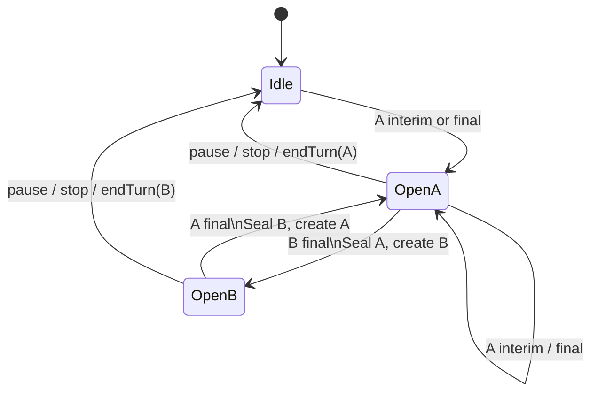
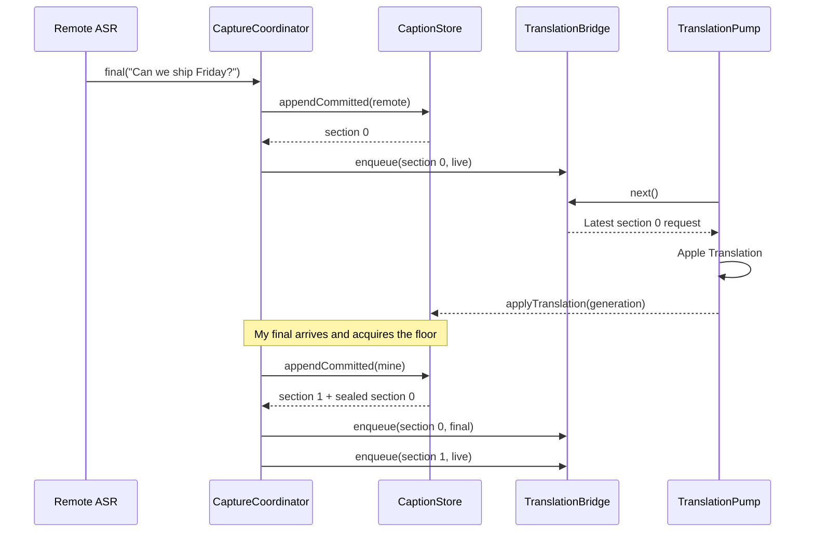

# Live Captions and Translation Pipeline

> This describes the current implementation. See [Conversation rendering requirements](conversation-rendering-requirements.md) for the design baseline; section 5.3 lists known differences.

## 1. The two inputs define speaker identity

The system distinguishes speakers at capture time rather than mixing audio and inferring identities:

| Input | Domain identity | Capture | Recognition |
|---|---|---|---|
| System output | `.remote` (other participant) | [`SystemAudioCaptureSCK`](../Sources/Capture/SystemAudioCaptureSCK.swift) | Independent [`NativeSpeechEngine`](../Sources/Capture/NativeSpeechEngine.swift) |
| Default microphone | `.mine` (you) | [`MicrophoneCapture`](../Sources/Capture/MicrophoneCapture.swift) | Independent [`NativeSpeechEngine`](../Sources/Capture/NativeSpeechEngine.swift) |

One-on-one meetings therefore need no diarization: identity comes from the physical channel. All people in system audio become `.remote`, so this is not a multi-party speaker identification solution.

## 2. Audio capture

### 2.1 System audio

[`SystemAudioCaptureSCK`](../Sources/Capture/SystemAudioCaptureSCK.swift):

- Uses the first available display to establish `SCStream`.
- Captures all system audio except the current app; no meeting-app selector.
- Requests 16 kHz mono Float32.
- Configures a minimal 2×2 video size because ScreenCaptureKit requires display capture even for audio-only use.
- Handles interleaved and planar PCM, downmixing to `[Float]`.

This replaced Core Audio Process Tap. The reason recorded in source is that enabling an AirPods microphone degraded the old tap's remote audio, while the SCK path was unaffected.

### 2.2 Microphone

[`MicrophoneCapture`](../Sources/Capture/MicrophoneCapture.swift) uses `AVAudioEngine.inputNode`:

- Requests permission before starting.
- Installs a tap in the device's native format and downmixes to mono before delivering callbacks.
- Observes `.AVAudioEngineConfigurationChange` and rebuilds the tap on input-device changes.
- Leaves resampling to the recognizer.

## 3. Recognizer lifecycle and concurrency

Each stream has an actor-isolated [`NativeSpeechEngine`](../Sources/Capture/NativeSpeechEngine.swift):

1. Request speech recognition authorization.
2. For English, create `DictationTranscriber(preset: .progressiveLongDictation)`; for Chinese, use `SpeechTranscriber(preset: .progressiveTranscription)`.
3. On first use of an English vocabulary version, build `SFCustomLanguageModelData` from saved names and acronyms, each with `PhraseCount(count: 1)`. Compile local model and vocabulary files and supply them through the `customizedLanguage` content hint. Empty vocabulary skips custom models. No custom pronunciations or model weights are configured.
4. Check and install system speech resources for the transcriber.
5. Query `SpeechAnalyzer.bestAvailableAudioFormat`.
6. Create `AnalysisContext`, also supplying vocabulary through `.general` contextual strings. Vocabulary adjusts candidate probabilities; it does not replace strings in recognized output.
7. Audio callbacks enqueue samples and the device sample rate at capture time as chunks in an `AsyncStream` retaining at most 64 chunks. Queued samples retain their original sample rate across device switches, and the real-time callback never accesses converter or Speech state.
8. Inside the actor, use `AVAudioConverter`'s streaming input-block API to resample to the recognizer format, then write `AsyncStream<AnalyzerInput>`.
9. Route nonfinal results to `onInterim` and final results to `onCommit`, awaiting the main actor's `CaptionStore` update.

[`CaptureCoordinator.makeSpeechEngine(for:sessionID:)`](../Sources/Meeting/CaptureCoordinator.swift) binds callbacks to `.remote`/`.mine` and the session UUID. Late results from an old recognizer fail the token check and cannot enter a new meeting.

### 3.1 English vocabulary and activation boundary

The app identity is `com.plus.samewave`, including its UserDefaults vocabulary domain. Models use `Application Support/SameWave/SpeechLanguageModel` and `com.plus.samewave.terms`. Vocabulary and caches under an older identity are not read or migrated; old files are not deleted.

[`SpeechVocabularySettings`](../Sources/Capture/SpeechVocabularySettings.swift) supplies 41 default terms on first launch, then persists the user's entire saved vocabulary in UserDefaults. Manual Add Terms accepts one phrase per line, preserves commas within phrases, removes blank lines, trims surrounding whitespace, and deduplicates case-insensitively. An invalid line blocks the whole add; terms are limited to 100 characters. An explicitly saved empty vocabulary stays empty rather than restoring defaults.

Settings > Vocabulary directly contains the Personal Vocabulary editor in the existing 600×540 Settings sheet. Switching to AI Services keeps the same presenter and dimensions. Configure AI Services selects that tab; Done closes Settings. The shared editor offers multiline Add Terms, inline row Save/Cancel, direct removal, and optional Markdown extraction. Each vocabulary action commits explicitly; AI Services has a separate retained draft and its Save/Cancel never changes vocabulary. The old bulk settings draft and import-to-draft merge path are removed.

The shared editor keeps its outer cards in one ordinary ScrollView. Saved terms and suggestions use separate LazyVStacks with stable row heights, so large vocabularies render nearby rows on demand without changing the scroll extent as rows appear. Inline saved-term validation stays within the row; its full explanation is available through the tooltip and accessibility label. Saved vocabulary and suggestions have independent view bodies, so tab navigation does not rebuild their data. Hidden vocabulary content rejects pointer/accessibility interaction and its focus/keyboard handlers check the active tab, avoiding a whole-list enabled-state change.

Personal Markdown selection loads local temporary inputs without making a request. Extract Vocabulary explicitly sends their text. Temporary files, uncommitted manual/row edits, selected suggestions, and disclosure/reading state belong to the app-session editor, so switching tabs or closing either vocabulary host retains them and lets extraction continue. Stop cancels current and pending requests while retaining results. Retry Incomplete uses the immutable original inputs and skips successful requests. Discard clears pending suggestions and progress only after extraction is stopped. App exit clears unfinished work and temporary files; saved terms persist.
Local input is UTF-8 `.md`/`.markdown`, at most 3 MB per file and 30 MB per selection, with no total body-character limit. Content is split into internal fragments of at most 18,000 characters, then grouped into serial AI requests of at most 20,000 characters. Fragments are assembly units, not individual API calls. Each request retries at most twice after its first failure; a third failed attempt is recorded and later requests continue.

Each successful request returns at most 50 terms under strict JSON Schema. The prompt prioritizes abbreviations, personal names, and specialized terminology valuable for English ASR. Ordinary words require both central importance and repeated mentions; capitals/headings alone do not qualify. It prefers compact spoken terms and shared roots while retaining meaningful multiword names. No client-side whitespace splitting is applied. Filenames are not sent. Candidates contain term strings only and are deduplicated against saved vocabulary, current suggestions, and previously received originals. Stable candidate IDs preserve edits and deselection during later arrivals. Add to Vocabulary validates selected rows only and deduplicates again at commit time. It never commits a manual draft. Save failures retain edits and selection for retry. Suggested Terms owns selection controls, Add, Discard, and success/error feedback, with repeated controls inside long cards. The global footer only dismisses. Progress and the latest failed reason appear inline; there are no request details, source metadata, document-content previews, or Review tab.

Meeting Preparation separates Context from Vocabulary. Context owns persisted managed Markdown copies; the meeting editor references the count and returns to Context for attachment changes. The same editor and extraction controller save to the meeting's vocabulary rather than personal settings. Each scope supports manual input without AI configuration. See [session data](03-session-lifecycle-and-data.md).
Starting or resuming a meeting freezes the combined confirmed meeting vocabulary and saved personal vocabulary in `CaptureCoordinator`, with meeting spellings taking precedence for case-insensitive duplicates and passes the same snapshot to both recognizers. Editing vocabulary during recording cannot change those recognizers; changes take effect at the next English start/resume. Chinese recognition does not use the English vocabulary.

Custom model directories are separated by locale and a SHA-256 vocabulary fingerprint. Prepared models are reusable for identical vocabulary; changed vocabulary creates a new configuration. Apple Speech training data and model files stay local. AI reuses saved vocabulary differently: refinement freezes the complete personal list at operation start, insights send the full applicable meeting/personal list with a saved version, and titles send none. These AI uses do not change local recognition's privacy boundary; see [AI insights and refinement](04-ai-insights-and-refinement.md).

### 3.2 Deterministic stopping

Pause/end stops capture first, then `NativeSpeechEngine.stop()`:

1. Closes sample input and converts all queued audio.
2. Ends analyzer input and calls `finalizeAndFinishThroughEndOfInput()`.
3. Waits for the Speech result stream, including every result's main-actor callback.

The last final ASR result is therefore in the store before sealing and final persistence. If Speech finalization fails, cancel result processing and preserve the best available text rather than waiting indefinitely.

## 4. Section model

[`Section`](../Sources/Meeting/MeetingModels.swift) is the shared live unit for UI, translation, and persistence:

| Field | Meaning |
|---|---|
| `id` | Monotonically increasing within a session; display order |
| `speaker` | `.mine` or `.remote` |
| `contentState` | `.open` / `.sealed`: whether new source text is accepted |
| `translationState` | `.pending` / `.translating` / `.done` / `.failed` |
| `committedSource` | Final ASR sentences |
| `interimSource` | Current volatile hypothesis |
| `targetText` | Current translation |
| `generation` | Translation version for rejecting stale results |
| `startedAt` | Section opening time |
| `priorContext` | Speaker context frozen when opened |

Content and translation states are orthogonal. Sealing prohibits new source text but does not cancel translation.

## 5. Actual state machine: single floor

[`CaptionStore`](../Sources/Meeting/CaptionStore.swift) currently permits at most one open Section:

Floor acquisition has two asymmetric rules:

- Idle floor: interim can open a Section for early feedback.
- Occupied floor: the other speaker's interim is ignored; only a final commit can switch the floor.

This prevents noise, echoes, and crossing partials from continually splitting turns. Section order follows final commits that acquire the floor, not precise acoustic onset time.

### 5.1 Final commits

`appendCommitted`:

1. Acquires the floor for the speaker, sealing the previous Section on a switch.
2. Appends the final sentence to `committedSource` and clears interim text.
3. Updates that speaker's recent-sentence window.
4. Returns the current Section ID and any newly sealed ID for translation scheduling.

A speaker's uninterrupted contribution stays in one Section. After six final sentences, the next sentence opens another Section. This limits bubble size rather than defining semantic sentence boundaries.

### 5.2 Interim results

`updateInterim` updates only an open Section's volatile tail. Nonfinal interim from the speaker without the floor is hidden. On sealing, interim-only content is promoted to committed text so already visible words do not disappear; truly empty Sections are pruned.

### 5.3 Differences from the product state-machine baseline

| Topic | Requirements | Current implementation |
|---|---|---|
| New turn | Immediate switch on `onSpeechStart(other)` | Switch on the other's final ASR commit |
| Silence | Seal on `onSpeechEnd` | No continuous silence/VAD sealing; primarily speaker switch, six-sentence limit, pause/stop |
| Overlap | Explicit `OVERLAP`, tracking both speakers | Single floor, at most one open Section |
| Interrupted speaker continues | New Section at speech start | Reacquire floor and open at next final commit |
| Sealed source correction | Correction-only updates allowed | No separate sealed-ASR correction entry; generation handles stale translations only |

These are deliberate implementation simplifications. Requirements pseudocode is not the current runtime contract.

## 6. Translation scheduling

When source and target differ, each valid interim/final can trigger retranslation. Sealing submits an authoritative `isFinal=true` request. Same-language pairs create no translation requests.

### 6.1 Coalescing mailbox

[`TranslationBridge`](../Sources/Meeting/TranslationBridge.swift) is not an unbounded FIFO:

- Requests are keyed by `sectionId`.
- A newer snapshot replaces a pending request for the same Section.
- Different Sections retain independent slots, dequeued in earliest-waiting order.
- In-flight requests cannot be recalled, but generation checks reject stale results.
- Every request carries a session UUID, preventing writes into a later meeting.
- Explicit pending/in-flight counts support `waitUntilIdle` for pause/end rather than guessed sleep durations.

The latest state controls load, rather than fixed-time throttling.

Success, failure, and cancellation all complete in-flight accounting. A failed request marks its Section `.failed` and preserves source text. If Translation session preparation fails, waiting requests fail explicitly instead of remaining stuck on Translating.

### 6.2 Generation checks

Each scheduling operation increments the Section's `generation`. Only a result matching the current generation can update `targetText`, preventing a late older request from overwriting newer text.

### 6.3 Context window

Translation context is independent of the six-sentence UI limit:

- Each speaker retains the latest five committed sentences, approximately 240 characters maximum.
- A new Section freezes `priorContext`.
- Input is `context + " ||| " + target`.
- After Apple Translation returns, extract the text after the last delimiter. If the delimiter is missing, translate the target alone.

Frozen snapshots prevent context drift and preserve continuity across a speaker's Sections.

## 7. Speaker-switch sequence

## 8. Language pairs

- Independent source and target menus both use the fixed English labels English and Simplified Chinese, yielding four combinations.
- Source determines both ASR locales: `en-US` or `zh-CN`. English vocabulary applies only to an English source.
- Different languages use `TranslationSession` to produce `targetText`, displayed above secondary source text.
- Matching languages create neither a Translation session nor requests. The coordinator sets `targetText = sourceText`; the UI hides duplicate source echo.
- Both menus are disabled after starting to keep recognizers, translation, and the persisted pair consistent throughout the meeting.

## 9. Key invariants

1. At most one open Section at a time.
2. Section IDs increase monotonically; array order is display order.
3. `contentState` does not govern whether translation can continue.
4. Old translations cannot overwrite a newer generation.
5. Pending requests may coalesce within one Section, never evict another Section.
6. Restored Sections are sealed/done; the next utterance opens a new Section.
7. Same-language meetings send no translation requests and show no duplicate text.
8. Old-session ASR/translation callbacks cannot modify a new session.
9. Pause/end drains queued audio and awaits final ASR before persistence; translation has a bounded wait.
