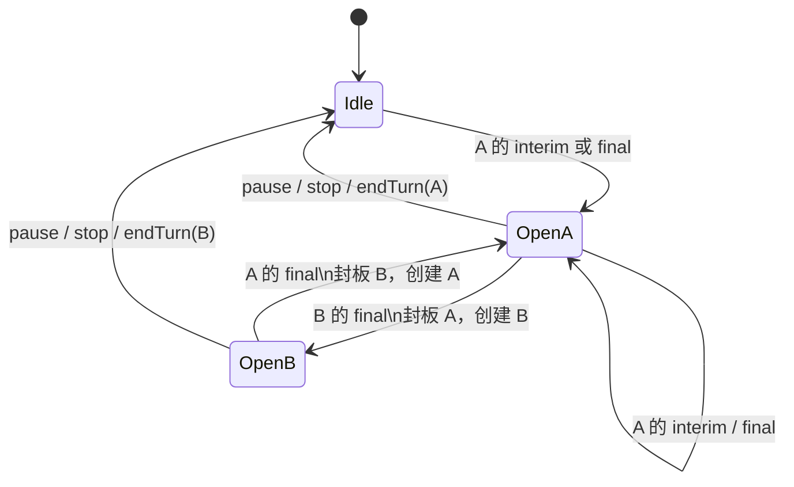
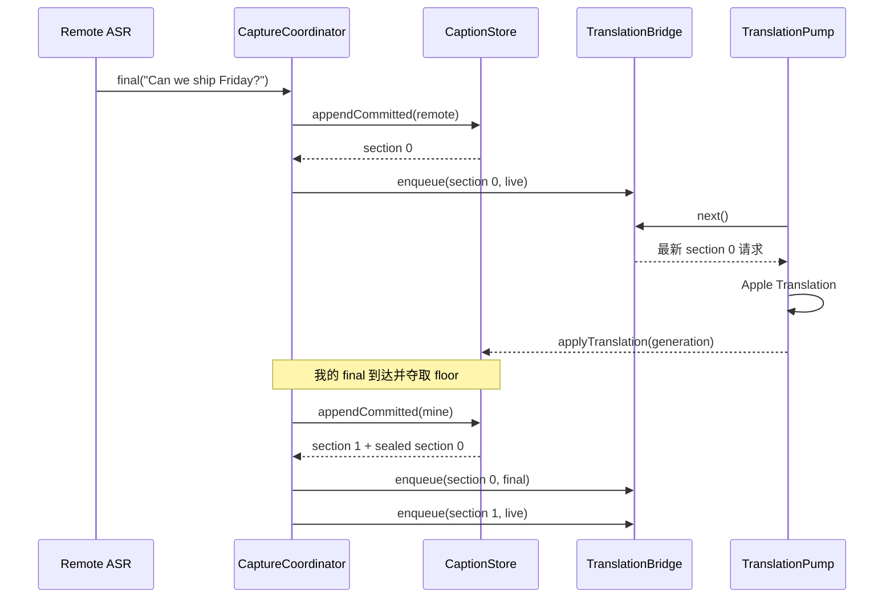

# 实时字幕与翻译流水线

> 本文描述当前实现。产品设计基线见 [会议实时翻译-对话渲染需求与状态机.md](会议实时翻译-对话渲染需求与状态机.md)；已知差异在第 5.3 节列出。

## 1. 双输入拓扑就是身份模型

系统没有先把音频混在一起再猜说话人，而是在采集入口就区分：

| 输入流 | 领域身份 | 捕获器 | 识别器 |
|---|---|---|---|
| 系统输出 | `.remote`（对方） | [`SystemAudioCaptureSCK`](../Sources/Capture/SystemAudioCaptureSCK.swift) | 独立 [`NativeSpeechEngine`](../Sources/Capture/NativeSpeechEngine.swift) |
| 默认麦克风 | `.mine`（我） | [`MicrophoneCapture`](../Sources/Capture/MicrophoneCapture.swift) | 独立 [`NativeSpeechEngine`](../Sources/Capture/NativeSpeechEngine.swift) |

这使一对一场景不需要 diarization。身份准确性来自物理通道，而不是统计模型。代价是系统音频里的所有人都会统一成为 `.remote`，因此它不是多人会议的说话人识别方案。

## 2. 音频采集

### 2.1 系统音频

[`SystemAudioCaptureSCK`](../Sources/Capture/SystemAudioCaptureSCK.swift)：

- 选择首个可用 display 建立 `SCStream`。
- 捕获全部系统音频，排除当前 app；没有会议应用选择器。
- 请求 16 kHz、单声道、Float32。
- ScreenCaptureKit 即使只需要音频也要求 display capture，因此配置 2×2 的最小视频尺寸。
- 回调中兼容交错和 planar PCM，并下混成 `[Float]`。

代码由旧 Core Audio Process Tap 迁移到 ScreenCaptureKit。源码记录的直接原因是：打开 AirPods 麦克风会降低旧 tap 的远端音频质量，而 SCK 路径不受影响。

### 2.2 麦克风

[`MicrophoneCapture`](../Sources/Capture/MicrophoneCapture.swift) 使用 `AVAudioEngine.inputNode`：

- 启动前申请权限。
- 以设备原生格式安装 tap，回调前下混为单声道。
- 监听 `.AVAudioEngineConfigurationChange`；输入设备变化时重建 tap。
- 不在采集器中重采样，交给识别器统一处理。

## 3. 识别器生命周期与并发边界

两路音频各有一个 actor 隔离的 [`NativeSpeechEngine`](../Sources/Capture/NativeSpeechEngine.swift)：

1. 请求语音识别授权。
2. 创建指定 locale 的 `SpeechTranscriber(preset: .progressiveTranscription)`。
3. 检查并安装系统语音资源。
4. 查询 `SpeechAnalyzer.bestAvailableAudioFormat`。
5. 创建 `AnalysisContext`，把当前实验性硬编码的 41 个产品名、缩写和人名写入 `.general` contextual strings；系统音频和麦克风两路使用同一份上下文。这里的词表只提高识别概率，不强制替换结果，也没有用户配置或持久化入口。
6. 音频回调把样本和当时的设备采样率作为一个 chunk，通过最多保留 64 个 chunk 的 `AsyncStream` 进入 actor；设备切换不会让已排队样本被新采样率解释，实时回调线程也不访问 converter 或 Speech 状态。
7. actor 中使用 `AVAudioConverter` 的流式 input-block API 转换格式，以支持麦克风设备采样率到识别器采样率的重采样，再写入 `AsyncStream<AnalyzerInput>`。
8. 结果流将非 final 发送到 `onInterim`，final 发送到 `onCommit`，并等待主 actor 写入 `CaptionStore` 完成。

[`CaptureCoordinator.makeSpeechEngine(for:sessionID:)`](../Sources/Meeting/CaptureCoordinator.swift) 在创建回调时绑定 `.remote` 或 `.mine` 和当前会话 UUID。旧识别器延迟返回的结果因 token 不匹配而被丢弃，不会混入新会议。

### 3.1 确定性停止

暂停或结束时先停止采集器，然后 `NativeSpeechEngine.stop()` 按顺序：

1. 关闭样本入口并转换完已经排队的音频。
2. 结束 analyzer 输入并调用 `finalizeAndFinishThroughEndOfInput()`。
3. 等待 Speech 结果流结束；每个结果的主 actor 回调也在这个边界内完成。

因此协调器封板和最终保存时，最后一句 final ASR 已经进入 store。如果 Speech finalization 失败，结果任务会被取消并保留已经获得的最佳文字，不会无限等待。

## 4. Section 数据模型

[`Section`](../Sources/Meeting/MeetingModels.swift) 是 UI、翻译和持久化的共同实时单位：

| 字段 | 含义 |
|---|---|
| `id` | 会话内单调递增，决定显示顺序 |
| `speaker` | `.mine` 或 `.remote` |
| `contentState` | `.open` / `.sealed`，是否接受新原文 |
| `translationState` | `.pending` / `.translating` / `.done` / `.failed` |
| `committedSource` | final ASR 句子数组 |
| `interimSource` | 当前易变假设 |
| `targetText` | 当前译文 |
| `generation` | 翻译版本号，用于丢弃过期结果 |
| `startedAt` | Section 打开时间 |
| `priorContext` | 打开时冻结的该说话人前文窗口 |

内容状态与翻译状态正交。封板只禁止追加新原文，不会取消翻译。

## 5. 当前实际状态机：single floor

当前 [`CaptionStore`](../Sources/Meeting/CaptionStore.swift) 保证任何时刻最多只有一个 open Section：

这里的“抢到 floor”有两条不对称规则：

- floor 空闲：interim 就可以创建 Section，让用户尽早看到文字。
- 另一人持有 floor：非 floor 一方的 interim 被忽略，只有 final commit 能切换 floor。

这避免瞬时噪声、回声或交叉 partial 不断切段。Section 的先后顺序实际是“final commit 夺取 floor 的顺序”，不是精确的语音 onset 时间。

### 5.1 final commit

`appendCommitted` 会：

1. 让当前 speaker 取得 floor；如发生换人，封板上一 Section。
2. 把 final 句子追加到 `committedSource`，清空 interim。
3. 更新该 speaker 的最近句子窗口。
4. 返回当前 Section id 和刚封板的 id，供协调器调度翻译。

同一说话人连续发言会保持在一个 Section 内；累积 6 个 final 句子后，下一句进入新的 Section。这是 UI 气泡大小限制，不是语义断句规则。

### 5.2 interim

`updateInterim` 只更新 open Section 的易变尾部。切换说话人时，未 final 的非 floor interim 不会显示。Section 封板时，如果只有 interim 而没有 committed 内容，interim 会被提升为 committed，以避免用户已经看到的文本突然消失；真正空的 Section 会被剪掉。

### 5.3 与产品状态机文档的差异

| 主题 | 需求文档 | 当前实现 |
|---|---|---|
| 换段触发 | `onSpeechStart(另一人)` 立即换段 | 另一人的 final ASR commit 才换段 |
| 静音结束 | `onSpeechEnd` 封板 | 没有持续的 silence/VAD 封板；主要在换人、6 句上限、暂停/停止时封板 |
| 重叠状态 | 显式 `OVERLAP`，可跟踪双方活跃 | 折叠为 single floor，最多一个 open Section |
| 被打断方续说 | speech-start 时新开 Section | 其下一次 final commit 时夺回 floor 并新开 Section |
| 已封板原文修正 | 允许 correction-only | 没有独立的已封板 ASR 修正入口；generation 只处理译文过期 |

这是有意的实现简化，不应把需求伪代码直接当成当前运行行为。

## 6. 翻译调度

英文模式中，每次有效 interim 和 final 都可触发重译；Section 封板时再发一次 `isFinal=true` 的权威翻译。

### 6.1 合并邮箱

[`TranslationBridge`](../Sources/Meeting/TranslationBridge.swift) 不是无限 FIFO：

- key 是 `sectionId`。
- 同一 Section 尚未取走的请求会被最新快照覆盖。
- 不同 Section 保留独立槽位，并按最早等待顺序取出。
- 已经执行的旧请求不能被撤回，但结果会被 generation 校验拒绝。
- 请求同时携带会话 UUID，上一场会议的在途结果不能修改新 store。
- bridge 显式统计 pending 和 in-flight 工作，为暂停/结束提供 `waitUntilIdle`，而不是靠固定睡眠猜测完成时间。

因此系统用“只处理最新状态”控制实时流量，而不是用固定时间节流。

翻译成功、失败和取消都会完成 in-flight 计数。单个请求失败会将对应 Section 标记为 `.failed` 并保留原文；Translation session 准备失败时，已等待请求也会被显式失败，不会永久卡在“翻译中”。

### 6.2 generation 防陈旧

每次调度先让 Section 的 `generation += 1`。翻译完成后，只有返回 generation 与当前一致才允许更新 `targetText`。这解决了后发请求先完成时旧结果覆盖新结果的问题。

### 6.3 上下文窗口

翻译上下文与 UI 的 6 句显示上限相互独立：

- 每个 speaker 维护最近 5 个 committed 句子，最多约 240 字符。
- 新 Section 打开时冻结 `priorContext`。
- 翻译输入为 `context + " ||| " + target`。
- Apple Translation 返回后尝试按最后一个分隔符取 target 部分；分隔符丢失则退化为仅翻 target。

冻结快照避免并发变化导致同一请求的语境漂移，也让同一说话人跨 Section 保持语义连续。

## 7. 一次换人事件的时序

## 8. 语言模式

- 英文：locale `en-US`，`sourceText` 为英文，Apple Translation 生成 `targetText`，UI 以中文为主、英文为辅。
- 中文：locale `zh-CN`，不创建翻译任务；`targetText = sourceText`，UI 隐藏重复原文。

语言选择在会话运行期间被禁用，防止现有识别器、翻译 session 和持久化语言不一致。

## 9. 关键不变量

维护核心代码时应保护以下行为：

1. 同一时刻最多一个 open Section。
2. Section id 单调递增，数组顺序即显示顺序。
3. `contentState` 不决定翻译能否继续。
4. 旧翻译结果不能覆盖新 generation。
5. 同一 Section 的待翻请求可合并，不同 Section 不能互相驱逐。
6. 恢复会话后旧 Section 全部 sealed/done，下一句话必须创建新 Section。
7. 中文模式不能显示两份相同文字。
8. 旧会话的 ASR/翻译回调不能修改新会话。
9. 暂停/结束在持久化前已排空待处理音频并等待 ASR final；翻译等待有明确上限。
