# Session Lifecycle and Data

> Main implementation: [`CaptureCoordinator.swift`](../Sources/Meeting/CaptureCoordinator.swift), [`MeetingHistory.swift`](../Sources/History/MeetingHistory.swift), [`TranscriptExporter.swift`](../Sources/History/TranscriptExporter.swift).

## 1. Explicit session state

[`MeetingSessionState`](../Sources/Meeting/MeetingModels.swift) is the sole source of lifecycle state:

| State | Meaning | Main transitions |
|---|---|---|
| `idle` | No mounted session | `startGlobal` or `mountPaused` |
| `starting` | Opening recognition/capture resources | `recording`, or `idle/paused` on failure |
| `recording` | Receiving both audio streams | `pausing` or `stopping` |
| `pausing` | Draining capture, ASR, translation | `paused` |
| `paused` | Session mounted without capture | `starting`, `stopping`, or unmount |
| `stopping` | Final drain and save | `idle`, or `paused` if saving fails |

`isRunning`, `isPaused`, and `isTransitioning` derive from this enum rather than combining booleans in `CaptionStore`. `sessionStartedAt` and `pausedElapsed` track time only; `activeRecord` owns the current persistent object only.

## 2. Lifecycle

```mermaid
stateDiagram-v2
    [*] --> Idle
    Idle --> Starting: startGlobal
    Paused --> Starting: resume
    Starting --> Recording: Required system audio pipeline ready
    Starting --> Idle: New meeting startup fails
    Starting --> Paused: Mounted meeting resume fails
    Recording --> Pausing: pause
    Pausing --> Paused: ASR / translation drain + save
    Recording --> Stopping: stop
    Paused --> Stopping: stop
    Stopping --> Idle: finish succeeds
    Stopping --> Paused: finish fails; retry available
    Paused --> Idle: Unmount after saving
```

### 2.1 Start

`startGlobal` enters `starting`, clears the live store, resets insights and timing, and immediately creates a `MeetingRecord` with `status=recording`. System audio is required: failure tears down resources, deletes the empty record, and returns to `idle`. An initial microphone failure is displayed but allows system audio to continue. Only after required resources are ready does the session enter `recording` and begin four-second autosave.

Creating the disk record before waiting for the first utterance is fundamental to crash recovery.

### 2.2 Pause

`pause` is awaitable:

1. Accumulate the current recording segment's duration.
2. Stop autosave and capture, drain queued audio, and await Speech finalization and store callbacks.
3. Seal the current floor and schedule final translation.
4. Wait up to five seconds for translation idle.
5. Sync text and set the record to `paused`, retaining Sections and the active record.

If persistence fails, keep the session mounted and show the error. Session-switching callers do not discard unsaved memory state.

### 2.3 Resume

`resume` enters `starting`, marks the record recording, and rebuilds capture/recognizers. A required-pipeline failure rolls back to paused while retaining text and elapsed time. Restored Sections are sealed/done; new speech opens a new Section.

### 2.4 End

`stop` shares the deterministic pause cleanup path: stop capture → drain audio → finalize Speech → seal → wait up to five seconds for translation → `finish`. It does not use a fixed sleep.

A translation timeout saves available source and best translation, immediately replaces the session token, and rejects late writes into later meetings. If `finish` fails, retain all memory state in paused mode so the user can retry. Unmount only after success.

### 2.5 Switch sessions

Multiple paused sessions may exist, but only one is mounted in memory:

- Leaving a recording session pauses and saves it first.
- Leaving a paused session syncs again and keeps it paused.
- Selecting another unfinished record rebuilds the store from SwiftData.
- Start a New Meeting unmounts the current session and shows a blank stage without starting capture.
- Pause/sync failure aborts switching and retains the current session.

`CaptureCoordinator.selectedHistoryRecord` represents read-only history being viewed. With no history selection, show the mounted session, or a new meeting if none is mounted. Sidebar, stage, and insights bind to this same selection. Whenever history selection or mounted record changes, persist the displayed meeting UUID to UserDefaults `selectedMeetingID`; remove the key when showing a new meeting. The coordinator updates selection after successful switch/end/delete, independently of View refresh or termination callbacks.

## 3. SwiftData models

### 3.1 MeetingRecord

Stores session-level data:

- Unique UUID, start/end time, source/target language pair, Section count.
- Lifecycle status: `recording | paused | ended`.
- Optional `insightJSON`.
- Optional `aiTitle`; without a valid title, display the start time.
- Optional `refinedAt` and `glossaryJSON`.
- Cascade relationship to `TranscriptLine`.

### 3.2 TranscriptLine

One persisted line corresponds to one Section at save time:

- `speaker`, `sourceText`, `targetText`, `spokenAt`.
- `orderIndex`: display order within the record.
- `sectionId`: stable live-Section upsert key.
- `refinedSource`, `refinedTarget`: additional AI-refined versions.

Refinement never overwrites original text. Users can switch between Original and Refined.

## 4. Incremental persistence

[`MeetingHistoryStore.sync`](../Sources/History/MeetingHistory.swift):

1. Filter Sections containing only whitespace or isolated punctuation.
2. Index existing `record.lines` by `sectionId`.
3. Update or insert each valid Section's line.
4. Delete lines whose empty Sections were pruned from the live store.
5. Update `lineCount`, `endedAt`, and optional status in one context save.

Stable-ID upsert avoids deleting and rebuilding the entire meeting every four seconds, reducing relationship churn and allowing resumed recording to update the same line.

`finish` saves final text, `endedAt`, and `status=ended` atomically, with no intermediate commit where text is updated but the meeting remains unfinished. `beginRecord`, `sync`, `setStatus`, `finish`, `unfinishedRecords`, and `delete` propagate SwiftData errors. Save failure rolls back the context before later operations can observe uncommitted changes. The coordinator presents errors at the relevant boundary instead of manufacturing success with `try?`. Failure to create the persistent container shows a blocking launch error rather than switching to an in-memory database.

## 5. Crash and exit recovery

- Normal termination: `applicationWillTerminate` immediately saves the current store snapshot.
- Crash: the latest four-second autosave remains on disk. The theoretical loss window is one autosave interval plus audio still being recognized.
- Next launch: normalize every `status != ended` record to paused, then look up the saved selection UUID. Ended records open read-only; unfinished records mount paused without starting capture.
- A previous new-meeting selection, missing/invalid UUID, or deleted record shows a new meeting and clears invalid selection. Other paused records remain in the sidebar; the newest one is not selected automatically. Database read/save failures show a recovery error and retain the key for retry.
- Recovery preserves `sectionId` and sets `nextId` to the maximum plus one, avoiding collisions.

## 6. History and export

- [`MeetingSidebar`](../Sources/App/MeetingSidebar.swift) uses a reverse-chronological SwiftData `@Query`, listing recording, paused, and ended meetings together.
- Ended records open read-only in [`HistoryDetailView`](../Sources/History/HistoryDetailView.swift).
- With `aiTitle`, sidebar rows show title, start time, and count/duration on three lines. Details use the title as primary text while retaining the start time. Blank/missing titles use start time instead.
- Both live and saved meetings export as Markdown.
- Historical export prefers refined text and prepends cached AI insights.
- Translated meetings export target and source; same-language meetings suppress duplicate source echo.
- Export headings, speaker labels, and metadata are English. Transcript and cached content are preserved. Dates use an English Gregorian format; durations use `m`/`s` units.

## 7. Consistency boundaries

- ASR finalization is deterministic; translation waits at most five seconds so an unresponsive system service cannot block lifecycle completion. Source is saved on timeout, while some translations may be missing.
- Four-second autosave still permits loss of the latest interval and audio without final ASR. Because audio is not saved, that part cannot be recovered offline.
- `applicationWillTerminate` is synchronous: it saves text already in the store but cannot asynchronously drain recognition as End does.
- `elapsedSeconds` counts active recording time. `endedAt = startedAt + elapsedSeconds`; pauses do not count toward duration.
