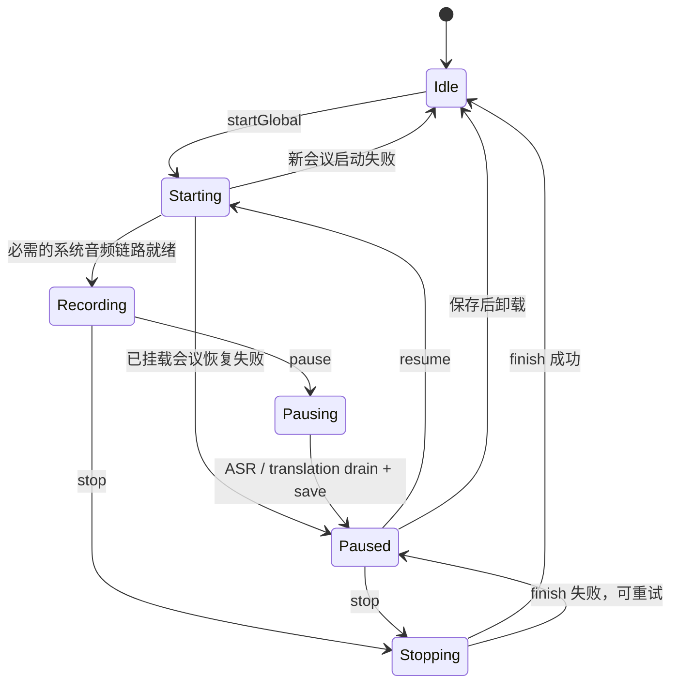

# 会话生命周期与数据

> 主要实现：[`Sources/Meeting/CaptureCoordinator.swift`](../Sources/Meeting/CaptureCoordinator.swift)、[`Sources/History/MeetingHistory.swift`](../Sources/History/MeetingHistory.swift)、[`Sources/History/TranscriptExporter.swift`](../Sources/History/TranscriptExporter.swift)。

## 1. 显式会话状态

[`MeetingSessionState`](../Sources/Meeting/MeetingModels.swift) 是会话生命周期的唯一状态源：

| 状态 | 含义 | 允许的主要转移 |
|---|---|---|
| `idle` | 没有挂载会话 | `startGlobal` 或 `mountPaused` |
| `starting` | 正在打开识别和采集资源 | `recording`，失败则 `idle/paused` |
| `recording` | 正在接收双路音频 | `pausing` 或 `stopping` |
| `pausing` | 正在排空采集、ASR 和翻译 | `paused` |
| `paused` | 会话仍挂载，但没有采集 | `starting`、`stopping` 或卸载 |
| `stopping` | 正在最终排空与保存 | `idle`，保存失败则 `paused` |

`isRunning`、`isPaused` 和 `isTransitioning` 都由该枚举派生，不再与 `CaptionStore` 内的布尔字段拼装状态。`sessionStartedAt` 和 `pausedElapsed` 只负责计时，`activeRecord` 只负责当前持久化对象。

## 2. 生命周期

### 2.1 开始

`startGlobal` 切换到 `starting`，清空实时 store，重置洞察和计时，然后立即创建 `status=recording` 的 `MeetingRecord`。系统音频是必需链路：启动失败会拆除已建资源、删除空记录并回到 `idle`。初始麦克风失败会显示错误，但允许系统音频继续。只有必需链路就绪后才进入 `recording` 并启动 4 秒 autosave。

先建磁盘记录、后等第一句话，是崩溃恢复成立的基础。

### 2.2 暂停

`pause` 是一个可等待操作：

1. 累计当前运行片段的时长。
2. 停止 autosave 和采集器，排空已排队音频，等待 Speech finalization 及其 store 回调。
3. 封板当前 floor 并调度 final 翻译。
4. 等待翻译进入 idle，最长 5 秒。
5. 同步文字并把记录标为 `paused`，保留 Section 和 active record。

持久化失败时会话保持挂载且错误可见；切换会话的调用方不会继续卸载未成功保存的内容。

### 2.3 恢复

`resume` 先进入 `starting` 并将 record 标为 recording，再重建采集与识别器。必需链路失败会回滚到 paused 并保留 elapsed time 和文字。已恢复的旧 Section 都是 sealed/done，新语音会创建新 Section。

### 2.4 结束

`stop` 与暂停共用同一条确定性收尾路径：停采集 → 排空音频 → Speech finalization → 封板 → 最多等待 5 秒翻译 → `finish`。不再使用固定睡眠。

若翻译超时，保存已有的原文和最佳译文；会话 token 立即更换，迟到结果不会回写新会议。若 `finish` 失败，转为 paused 并保留全部内存状态，用户可重试结束；成功后才卸载会话。

### 2.5 切换会话

工作区支持多个暂停会话同时存在，但内存中一次只挂载一个：

- 从录制中切走：先暂停并落盘。
- 从已暂停会话切走：再次同步并保持 `paused`。
- 选择另一个未结束记录：从 SwiftData 重建 store。
- 点击“开启新会议”：卸载当前会话并展示空白舞台，不自动开始采集。
- 如果暂停/同步失败，切换立即中止，不丢弃当前内存会话。

`CaptureCoordinator.selectedHistoryRecord` 表示正在查看的只读历史；为空时显示当前挂载会话，没有挂载会话则显示新会议。侧栏、舞台和洞察面板绑定同一份选择状态。每次历史选择或挂载记录变化时，将实际显示的会议 UUID 写入 UserDefaults 的 `selectedMeetingID`；显示新会议时移除该键。切换、结束和删除由协调器在成功后更新选择，不依赖 View 的刷新时机或退出回调保存。

## 3. SwiftData 模型

### 3.1 MeetingRecord

保存会话级信息：

- 唯一 UUID、开始/结束时间、源语言与目标语言组成的语言对、段数。
- `recording | paused | ended` 生命周期状态。
- 可选 `insightJSON`。
- 可选 `aiTitle`；没有有效 AI 标题时继续使用开始时间作为显示标题。
- 可选 `refinedAt` 和 `glossaryJSON`。
- 到 `TranscriptLine` 的 cascade relationship。

### 3.2 TranscriptLine

一条持久化 line 对应保存时的一条 Section：

- `speaker`、`sourceText`、`targetText`、`spokenAt`。
- `orderIndex`：记录内显示顺序。
- `sectionId`：实时 Section 的稳定 upsert key。
- `refinedSource`、`refinedTarget`：AI 优化后的附加版本。

原始文本永远不被优化稿覆盖，用户可在“原始/优化”间切换。

## 4. 增量保存算法

[`MeetingHistoryStore.sync`](../Sources/History/MeetingHistory.swift)：

1. 过滤只有空白或孤立标点的 Section。
2. 以现有 `record.lines[].sectionId` 建字典。
3. 对每个有效 Section 更新已有 line 或新建 line。
4. 删除已经被实时 store 剪掉的空 Section 对应 line。
5. 刷新 `lineCount`、`endedAt` 和可选会话状态，一次保存 context。

这里选择稳定 id upsert，而不是每 4 秒删除重建整场记录，减少关系抖动，也支持恢复后继续录制时更新同一行。

`finish` 把最终 transcript、`endedAt` 和 `status=ended` 放在同一次 save 中，不会产生“文字已更新但状态未结束”的中间提交。`beginRecord`、`sync`、`setStatus`、`finish`、`unfinishedRecords` 和 `delete` 都会抛出 SwiftData 错误；任何 save 失败都先 rollback context，避免未提交变更泄漏到下一次操作。协调器在对应边界将错误变为用户可见状态，不再用 `try?` 制造虚假成功。应用启动时如果持久容器无法创建，显示阻断错误页，不会回退到内存数据库。

## 5. 崩溃与退出恢复

- 正常退出：`applicationWillTerminate` 立即保存当前 store 快照。
- 崩溃：最近一次 4 秒 autosave 仍在磁盘，理论损失窗口不超过一个周期外加正在识别的未落盘音频。
- 下次启动：将所有 `status != ended` 的记录规范成 paused，再按保存的 UUID 查找上次选中的会议。结束记录进入只读历史，未结束记录挂载为 paused，不自动开始采集。
- 上次选择新会议、没有保存的 UUID、UUID 无效或记录已删除时，显示新会议并清除失效选择；其他暂停记录仍保留在侧栏，不自动改选最新记录。数据库读取或保存失败会显示恢复错误，并保留原选择键供下次重试。
- 恢复时保留原 `sectionId`，`nextId` 从最大值加一继续，避免新旧冲突。

## 6. 历史展示与导出

- 左栏由 [`MeetingSidebar`](../Sources/App/MeetingSidebar.swift) 中的 SwiftData `@Query` 按时间倒序驱动，录制中、暂停和结束记录在同一列表。
- 结束记录进入只读 [`HistoryDetailView`](../Sources/History/HistoryDetailView.swift)。
- 成功生成 `aiTitle` 后，侧栏以“AI 标题 / 开始时间 / 段数与时长”三行展示，历史详情以它作为主标题并保留开始时间；标题缺失或为空时仍以开始时间作为主标题。
- 实时和历史都可导出 Markdown。
- 历史导出优先使用优化稿，并在开头附加已缓存的智能洞察。
- 不同语言的会议导出目标语言与源语言两层文字；同语言会议抑制重复 source echo。

## 7. 数据一致性边界

- ASR 收尾是确定性的；翻译 drain 则主动设置 5 秒上限，避免系统 Translation 服务卡住会议生命周期。超时时原文一定保存，部分译文可能缺失。
- autosave 周期为 4 秒。崩溃仍可能损失最近一个周期以及尚未生成 final ASR 的音频；因为应用不保存音频，这部分无法离线恢复。
- `applicationWillTerminate` 是同步回调，能落盘已在 store 中的文字，但不能像用户点击“结束”一样异步排空尚在识别的音频。
- `elapsedSeconds` 统计有效录制时长；`endedAt = startedAt + elapsedSeconds`，暂停时长不计入会议时长。
