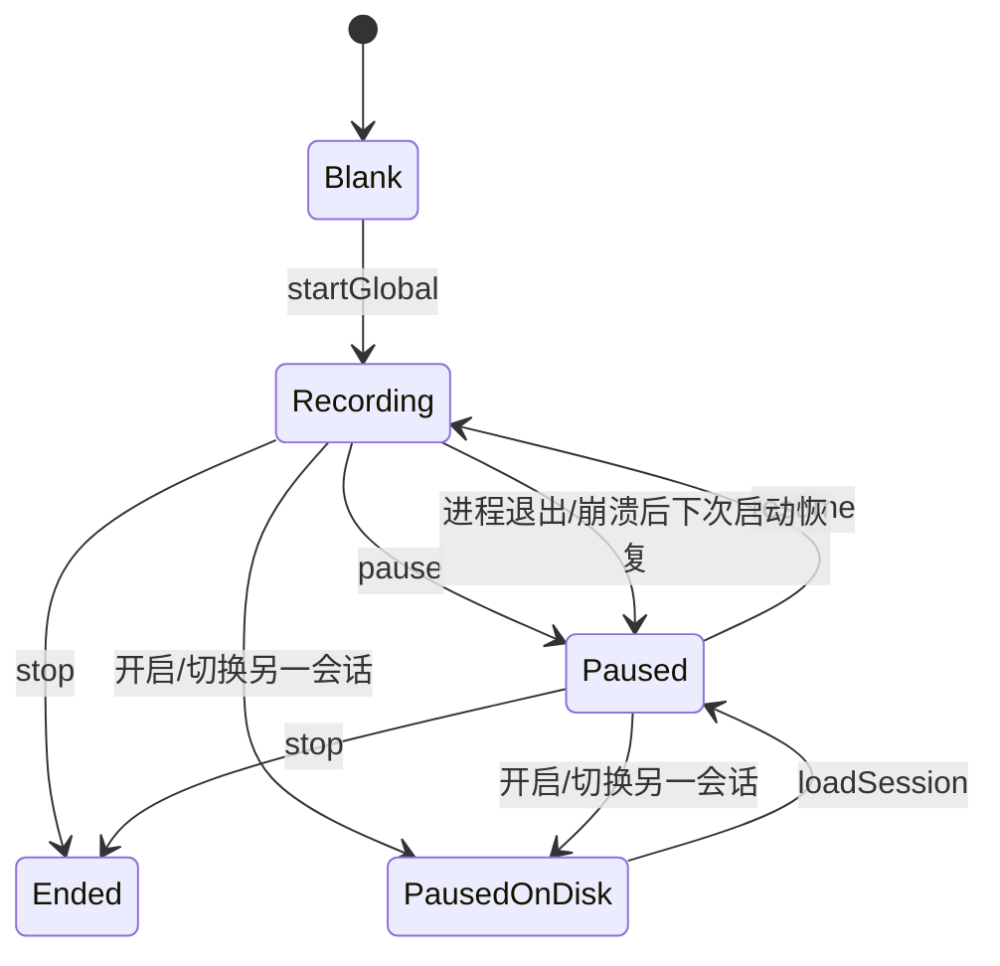

# 会话生命周期与数据

> 主要实现：[`Sources/Meeting/CaptureCoordinator.swift`](../Sources/Meeting/CaptureCoordinator.swift)、[`Sources/History/MeetingHistory.swift`](../Sources/History/MeetingHistory.swift)、[`Sources/History/TranscriptExporter.swift`](../Sources/History/TranscriptExporter.swift)。

## 1. 会话状态不是单一枚举

当前代码由几个字段共同表达状态：

- `store.isRunning`：是否挂载了一个可继续的会话。
- `isPaused`：挂载的会话是否暂停。
- `sessionStartedAt`：当前运行片段的起点。
- `pausedElapsed`：此前所有运行片段的累计时长。
- `activeRecord`：当前对应的 SwiftData 记录。

组合后的用户状态是：

| 状态 | `isRunning` | `isPaused` | `activeRecord` |
|---|---:|---:|---|
| 空白/已停止后的非活动态 | false | false | nil |
| 正在录制 | true | false | 有值 |
| 已暂停、可恢复 | true | true | 有值 |

暂停仍保持 `isRunning=true`，因为它表示“当前挂载的进行中会话”，并不等同于采集流正在工作。

## 2. 生命周期

### 2.1 开始

`startGlobal` 清空实时 store，重置洞察和计时，立即创建 `status=recording` 的 `MeetingRecord`，启动 4 秒一次的 autosave，然后分别启动 remote 和可选 mic 流。

先建磁盘记录、后等第一句话，是崩溃恢复成立的基础。

### 2.2 暂停

`pause`：

1. 累计当前运行片段的时长。
2. 停止 autosave、两个采集器和两个识别器。
3. 封板当前 floor 并调度 final 翻译。
4. 同步文字并把记录标为 `paused`。
5. 保留内存中的 Section 和 active record。

### 2.3 恢复

`resume` 重新启动采集和识别器，继续原有 elapsed time 和 SwiftData record。已经恢复到内存的旧 Section 都是 sealed/done，因此新语音会进入新 Section。

### 2.4 结束

`stop` 停止采集、封板、计算 endedAt，并在约 900ms 后做最后一次 `finish`；随后立即清空会话标量，但把实时文字留在屏幕上，UI 会选中刚结束的历史记录。

### 2.5 切换会话

工作区支持多个暂停会话同时存在，但内存中一次只挂载一个：

- 从录制中切走：先暂停并落盘。
- 从已暂停会话切走：再次同步并保持 `paused`。
- 选择另一个未结束记录：从 SwiftData 重建 store。
- 点击“开启新会议”：卸载当前会话并展示空白舞台，不自动开始采集。

## 3. SwiftData 模型

### 3.1 MeetingRecord

保存会话级信息：

- 唯一 UUID、开始/结束时间、语言、段数。
- `recording | paused | ended` 生命周期状态。
- 可选 `insightJSON`。
- 可选 `refinedAt` 和 `glossaryJSON`。
- 到 `TranscriptLine` 的 cascade relationship。

### 3.2 TranscriptLine

一条持久化 line 对应保存时的一条 Section：

- `speaker`、`sourceText`、`targetText`、`spokenAt`。
- `orderIndex`：记录内显示顺序。
- `sectionId`：实时 Section 的稳定 upsert key。
- `refinedSource`、`refinedTarget`：AI 优化后的附加版本。

原始文本永远不被优化稿覆盖，用户可在“原始/优化”间切换。

## 4. 增量保存算法

[`MeetingHistoryStore.sync`](../Sources/History/MeetingHistory.swift)：

1. 过滤只有空白或孤立标点的 Section。
2. 以现有 `record.lines[].sectionId` 建字典。
3. 对每个有效 Section 更新已有 line 或新建 line。
4. 删除已经被实时 store 剪掉的空 Section 对应 line。
5. 刷新 `lineCount`、`endedAt` 并保存 context。

这里选择稳定 id upsert，而不是每 4 秒删除重建整场记录，减少关系抖动，也支持恢复后继续录制时更新同一行。

## 5. 崩溃与退出恢复

- 正常退出：`applicationWillTerminate` 立即 `persistNow`。
- 崩溃：最近一次 4 秒 autosave 仍在磁盘，理论损失窗口不超过一个周期外加正在识别的未落盘音频。
- 下次启动：查询所有 `status != ended` 的记录，挂载最新一条为 paused；其余也规范成 paused 并保留在侧栏。
- 恢复时保留原 `sectionId`，`nextId` 从最大值加一继续，避免新旧冲突。

## 6. 历史展示与导出

- 左栏由 [`MainView`](../Sources/App/MainView.swift) 中的 SwiftData `@Query` 按时间倒序驱动，录制中、暂停和结束记录在同一列表。
- 结束记录进入只读 [`HistoryDetailView`](../Sources/History/HistoryDetailView.swift)。
- 实时和历史都可导出 Markdown。
- 历史导出优先使用优化稿，并在开头附加已缓存的智能洞察。
- 英文会议导出中英双语；中文会议抑制重复 source echo。

## 7. 数据一致性边界

当前实现有几个值得验证的窗口：

- `stop` 用固定 900ms 等最后翻译，而不是等待明确的“所有 final 翻译完成”信号；较慢翻译可能晚于最终落盘。
- 多数 SwiftData `save` 使用 `try?`，磁盘错误不会进入用户可见状态。
- 持久化容器创建失败时会切到内存容器，应用可继续运行，但用户可能误以为历史已经持久保存。
- `elapsedSeconds` 统计的是有效录制时长；`endedAt` 由 `startedAt + elapsedSeconds` 推导，所以暂停时长不会计入会议时长。

这些是当前实现事实，不是需求承诺。涉及可靠性改造时，应优先为它们补可观察错误和确定性完成条件。
